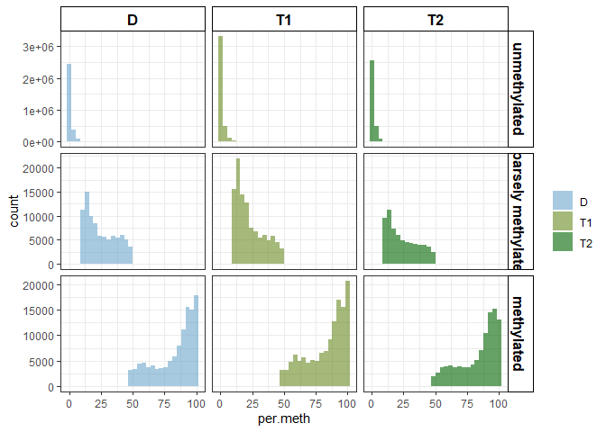

Identifying differentially methylated genes
================
EL Strand

Input from this script:
<https://github.com/emmastrand/EmmaStrand_Notebook/blob/master/_posts/2021-10-21-KBay-Bleaching-Pairs-WGBS-Analysis-Pipeline.md#kbay-wgbs-methylation-analysis-pipeline>

I’m following Hollie Putnam and Kevin Wong’s pipelines. -
<https://github.com/kevinhwong1/Thermal_Transplant_Molecular/blob/main/scripts/WGBS_GM.Rmd>

## Load libraries

<https://github.com/hputnam/Geoduck_Meth/blob/master/RAnalysis/Scripts/GM.Rmd>

``` r
# BiocManager::install("goseq")

library(plyr)
library(dplyr)
library(ggplot2)
library(tidyverse)
library(readxl)
library(plotrix) 
library(gridExtra)
library(seacarb) 
library(pheatmap)
library(tidyr)
library(gplots)
library(cowplot)
library(lsmeans)
library(data.table)
library(RColorBrewer)
library(randomcoloR)
#library(GSEABase)
library(ggpubr)
library(hrbrthemes)
library(viridis)
library(factoextra)
#library(ropls)
#library(mixOmics)
library(vegan)
library(Rmisc)
library(parallel)
```

## Load DNA methylation files

Below commands were only run use to produce data file and then not run
again for computational purposes.

``` r
# meth5x <- list.files(path = "data/WGBS/output/meth_counts_5x", 
#                      pattern = ".bed$", full.names=TRUE) %>% set_names(.) %>%
#   map_dfr(read.csv,.id="Sample.ID", header=FALSE, sep="\t", na.string="NA", stringsAsFactors = FALSE) %>%
#   dplyr::select(-c(V3,V7:V14)) 
# 
# colnames(meth5x) <- c("Sample.ID", "scaffold", "position","per.meth","meth","unmeth","gene")
# meth5x$gene <- gsub("ID=","",meth5x$gene) #remove extra characters
# meth5x$gene <- gsub("Parent=","",meth5x$gene) #remove extra characters
# meth5x$Sample.ID <- gsub("data/WGBS/output/meth_counts_5x/","",meth5x$Sample.ID) #remove extra characters
# meth5x$Sample.ID <- gsub("_5x_sorted.tab_gene_CpG_5x_enrichment.bed","",meth5x$Sample.ID) #remove extra characters 
# meth5x$Sample.ID <- as.character(meth5x$Sample.ID)
```

Load df created in code above

``` r
load("data/WGBS/meth5x.RData")
```

### Metadata files

``` r
meta <- read.csv("data/metadata/Molecular_metadata.csv") %>%
  mutate(Timepoint = if_else(Plug_ID == "2153", "12 hour", Timepoint)) %>%
  dplyr::rename(Sample.ID = Plug_ID) %>% 
  dplyr::select(Sample.ID, Species, Tank, Treatment, Temperature, CO2, Timepoint, Sample.Date) 
  
meta$Sample.ID <- as.character(meta$Sample.ID)

meta$Timepoint <- factor(meta$Timepoint, 
                           levels = c("0 hour", "6 hour", "12 hour", "30 hour",
                                      "1 week", "2 week", "4 week", "6 week",
                                      "8 week", "12 week", "16 week"))

pacuta_clade <- read.delim2("data/metadata/clade_annotations_Pacuta.txt", header = TRUE, sep="\t") %>%
  separate(., Sample, c("Species", "Treatment", "Timepoint", "Sample.ID")) %>% 
  dplyr::select(-Treatment, -Timepoint) %>% dplyr::select(Sample.ID, Clade)

ploidyinfo <- read.delim2("data/metadata/samples_Pacuta.annotations.txt", 
                          header=TRUE, sep="\t", na.strings=c("","NA")) %>% 
  dplyr::rename(., Sample.ID = plugid) %>% 
  mutate_if(is.integer, as.character) %>% 
  dplyr::select(Sample.ID, ploidy, group, treesplit) %>%
  #mutate(treesplit = coalesce(treesplit, "D")) %>% 
  #changing NA values to "D" in treesplit -- this is just so triploidy is split in 2 groups and diploidy is altogether 
  left_join(., pacuta_clade, by="Sample.ID")

meta <- dplyr::left_join(meta, ploidyinfo, by="Sample.ID")
save(meta, file = "data/metadata/meta.RData")
```

### Merge dataframes together

``` r
df5x <- full_join(meth5x, meta, by = "Sample.ID") %>%
  mutate(meth_exp_group = case_when(
    group == "Group1" ~ "T1",
    group == "Group2" ~ "T1",
    group == "Group3" ~ "T2",
    group == "Group4" ~ "T2",
    group == "Group5" ~ "D",
    group == "Group6" ~ "D",
    group == "Group7" ~ "ungroup",
    group == "Ungroup" ~ "ungroup")) %>% 
  subset(!group == "Group7" & !group == "Ungroup") %>%
  filter(!Sample.ID == "1225") %>% 
  filter(!Sample.ID == "2197") 

df5x %>% 
  dplyr::select(Sample.ID, meth_exp_group, per.meth) %>% 
  filter(!is.na(per.meth)) %>% dplyr::select(-per.meth) %>%
  filter(!Sample.ID == "1225") %>% 
  filter(!Sample.ID == "2197") %>%
  distinct() %>% write.csv("data/metadata/meth_pattern_groups.csv")
```

## Binomial GLM to test for differentially methylated genes

Filtering to genes that have at least 6 CpG loci in the dataset with 5X
coverage

Genes before \>5 loci filtering: 14,532 genes  
Genes after \>5 loci filtering: 9,647 genes

``` r
### Number of genes before filtering
length(unique(df5x$gene)) ## 14,532 genes
```

    ## [1] 14532

``` r
### Filtering
meth_table5x <- df5x
meth_table5x$sample_gene <- paste0(meth_table5x$Sample.ID, meth_table5x$gene)
meth_table5x_position_counts <- dplyr::count(meth_table5x, vars = c(sample_gene))

meth_table5x_position_counts <- meth_table5x_position_counts[which(meth_table5x_position_counts$n > 5), ]

meth_table5x_filtered <- meth_table5x[meth_table5x$sample_gene %in% meth_table5x_position_counts$vars,]

### Number of genes after filtering
length(unique(meth_table5x_filtered$gene))
```

    ## [1] 9647

Testing filtering by CpG loci median methylation %. Commented out so the
9,467 genes are carried through to DMG analysis

*Testing purposes, not used..*

``` r
# df_filtered  <- df5x %>%
#   #### [11,283,247 × 20] at this point
#   unite(Loc, scaffold, position, remove = FALSE, sep = " ") %>%
#   
#   #filtering out loci that have a median methylation of <10% across all samples
#   group_by(Loc) %>%
#   mutate(loci_median = median(per.meth)) %>%
#   filter(loci_median > 0) %>% ungroup() %>%
#   ### 946,050 × 21 after 
#   
#   # filtering out genes with less than 5 positions of data 
#   dplyr::group_by(gene) %>%
#   mutate(n_positions = n_distinct(position)) %>% ungroup() %>% ## count the number of unique positions for each gene
#   filter(n_positions >= 5) %>% dplyr::select(-n_positions)
#   ### 314,313 × 21 after
# 
# length(unique(df_filtered$Loc))
# ## 2,882 loci 
# 
# length(unique(df5x$gene)) ## 14,532 genes 
# length(unique(df_filtered$gene))
# ## 4,098 genes with median >0 
# ## 359 genes 

#####################


# df_filtered_posONLY  <- df5x %>%
#   #### [11,283,247 × 20] at this point
#   unite(Loc, scaffold, position, remove = FALSE, sep = " ") %>%
#   
#   # filtering out genes with less than 5 positions of data 
#   dplyr::group_by(gene) %>%
#   mutate(n_positions = n_distinct(position)) %>% ungroup() %>% ## count the number of unique positions for each gene
#   filter(n_positions >= 5) %>% dplyr::select(-n_positions)
#   ### 9,625,587 × 20
# 
# length(unique(df_filtered_posONLY$Loc))
# ## 98,294 loci 
# length(unique(df_filtered_posONLY$gene))
# ## 7,413 genes 
```

### Run loop for GLM

Binomial GLM to test for differentially methylated genes. For 359 genes
this took ~1 min.

*Testing purposes, not used..*

``` r
# ## DELETE OLD VERSIONS OF THIS FILE BEFORE RUNNING
# unlink("data/WGBS/GLM_output_methpos_filter.txt")
# gs5x <- unique(df_filtered$gene)
# 
# # Number of cores to use (this won't work on Windows)
# # num_cores <- detectCores() - 1
# 
# # Split the sub_meth_table.10x dataframe by 'gene'
# split_dfs <- split(df_filtered, df_filtered$gene)
# 
# # Preparing objects for data collection
# results <- list()
# results$Stats <- data.frame(matrix(nrow=length(gs5x), ncol=2), row.names=gs5x)
# colnames(results$Stats) <- c("gene", "pvalue_treatment")
# 
# ## Defining the run_glm function
# run_glm <- function(data){
#   
#   #Bayesian model
#   fit <- glm(matrix(c(meth, unmeth), ncol=2) ~ meth_exp_group, 
#              data=data, family=binomial)
#   
#   a <- anova(fit, test="Chisq")
#   
#   Gene <- unique(data$gene)
#   
#   #Gathering convergence stats
#   results$Stats[Gene, ] <- c(Gene, a$`Pr(>Chi)`[2])
#   
#   write.table(results$Stats[Gene, ], "data/WGBS/GLM_output_methpos_filter.txt", 
#               col.names=F, row.names=T, quote=F, append=T)
#   
# }
# 
# ### Lapply for the GLM 
# ### this will run through the run_glm function for multiple genes at a time and output
# mclapply(split_dfs, run_glm)
```

Binomial GLM to test for differentially methylated genes. For 7,413
genes this took ~10 minutes.

*Testing purposes, not used..*

``` r
# ## DELETE OLD VERSIONS OF THIS FILE BEFORE RUNNING
# unlink("data/WGBS/GLM_output_posFilter_only.txt")
# gs5x <- unique(df_filtered_posONLY$gene)
# 
# # Number of cores to use (this won't work on Windows)
# # num_cores <- detectCores() - 1
# 
# # Split the sub_meth_table.10x dataframe by 'gene'
# split_dfs <- split(df_filtered_posONLY, df_filtered_posONLY$gene)
# test <- split_dfs[1]
# 
# # Preparing objects for data collection
# results <- list()
# results$Stats <- data.frame(matrix(nrow=length(gs5x), ncol=2), row.names=gs5x)
# colnames(results$Stats) <- c("gene", "pvalue_treatment")
# 
# ## Defining the run_glm function
# run_glm <- function(data){
#   
#   #Bayesian model
#   fit <- glm(matrix(c(meth, unmeth), ncol=2) ~ meth_exp_group, 
#              data=data, family=binomial)
#   
#   a <- anova(fit, test="Chisq")
#   
#   Gene <- unique(data$gene)
#   
#   #Gathering convergence stats
#   results$Stats[Gene, ] <- c(Gene, a$`Pr(>Chi)`[2])
#   
#   write.table(results$Stats[Gene, ], "data/WGBS/GLM_output_posFilter_only.txt", 
#               col.names=F, row.names=T, quote=F, append=T)
#   
# }
# 
# ### Lapply for the GLM 
# ### this will run through the run_glm function for multiple genes at a time and output
# mclapply(split_dfs, run_glm)
```

Reading in those df so don’t need to calculate every time

*Testing purposes, not used..*

``` r
# results_filtered <- read.delim2("data/WGBS/GLM_output_methpos_filter.txt")
# results_posonly_filtered <- read.delim2("data/WGBS/GLM_output_posFilter_only.txt")
```

## Calculating adjusted p-values for glm

*Testing purposes, not used..*

``` r
# ## adjusting p-values 
# results_filtered$adj_pvalue_treatment <- p.adjust(results_filtered$pvalue_treatment, method='BH')
# results_posonly_filtered$adj_pvalue_treatment <- p.adjust(results_posonly_filtered$pvalue_treatment, method='BH')
# 
# ## filtering to p-values above 0.05 
# results_filtered_significant <- results_filtered %>% filter(adj_pvalue_treatment <= 0.050)
# results_posonly_filtered_significant <- results_posonly_filtered %>% filter(adj_pvalue_treatment <= 0.050)
```

### subsetting new df to only those adjusted p value columns

methgroup: 3,870 genes significantly DMG out of 9,467 genes that had at
least 5 positions and appeared in all samples.

``` r
results5x <- read.csv("data/WGBS/results5x_methgroup.csv", header = TRUE) %>% 
  dplyr::select(-X) %>% distinct() ## distinct() necessary in case the model above went through multiple times

results5x[is.na(results5x)] <- 0
results5x$adj.pval.methgroup <- p.adjust(results5x$pval.methgroup, method='BH')

DMG_5x_sig <- results5x %>%
  dplyr::select(gene, adj.pval.methgroup) %>% 
  mutate(across(2, round, 8)) %>%
  filter(adj.pval.methgroup < 0.050) 
```

    ## Warning: There was 1 warning in `mutate()`.
    ## ℹ In argument: `across(2, round, 8)`.
    ## Caused by warning:
    ## ! The `...` argument of `across()` is deprecated as of dplyr 1.1.0.
    ## Supply arguments directly to `.fns` through an anonymous function instead.
    ## 
    ##   # Previously
    ##   across(a:b, mean, na.rm = TRUE)
    ## 
    ##   # Now
    ##   across(a:b, \(x) mean(x, na.rm = TRUE))

``` r
nrow(DMG_5x_sig) # 3,870 for methgroup
```

    ## [1] 3870

``` r
DMG_5x_sig %>% write.csv("data/WGBS/DMG_5x_sig_methgroup.csv")
```

#### Dataframes at this point

- `eggNOGG` = original gene annotation file
- `OE` = output from CpG OE script with weakly and heavily methylated
  gene sets
- `gene_meta` = merged metadata of genes
- `df5x / df10x` = .bed files and metadata together
- `meth_table5x_filtered / meth_table10x_filtered` = output from
  filtering all genes with 5+ methylated positions; input for the glm
  model
- `gs5x / gs10x` = list of unique genes from filtered methylation
  table  
- `results5x / results10x` = output from glm model; contains gene names,
  pvalues and adjusted pvalues for differentially methylated  
- `DMG_5x_sig / DMG_5x_sig` = only adjusted pvalues from the results 5
  and 10x dfs

``` r
load("data/WGBS/meth_table5x_filtered.RData")

meth_table5x_filtered <- meth_table5x_filtered %>% 
  mutate(loci_status = case_when(
          per.meth <= 10 ~ "unmethylated",
          per.meth > 10 & per.meth < 50 ~ "sparsely methylated",
          per.meth >= 50 ~ "methylated"))

## hist for per.meth distribution for DMGs
meth_table5x_filtered_sigDMG <- meth_table5x_filtered[meth_table5x_filtered$gene %in% DMG_5x_sig$gene,]
```

## Methylation level calculations

### GENERAL HISTOGRAM OF CPG LOCI METHYLATION LEVEL

``` r
### number of loci per sample = 103,629 unique loci for all; 44,366 for sig DMG
## sample size of D = 16; T1=20; T2=17 

#### GENERAL HISTOGRAM OF CPG LOCI METHYLATION LEVEL 
## hist for per.meth distribution for all genes
meth_table5x_filtered %>%
  ggplot(aes(x=per.meth, fill=meth_exp_group)) + theme_bw() +
  facet_grid(factor(loci_status, levels=c('unmethylated','sparsely methylated','methylated'))~meth_exp_group, scales="free") +
  geom_histogram(alpha=0.6, position = 'identity') +
  scale_fill_manual(values=c("skyblue3", "olivedrab4", "darkgreen")) +
  labs(fill="") +
  theme(strip.text.x = element_text(size = 12, color = "black", face = "bold"),
        strip.text.y = element_text(size = 12, color = "black", face = "bold")) +
  theme(strip.background = element_rect(color="black", fill="white", linewidth=0.5, linetype="solid"))
```

    ## `stat_bin()` using `bins = 30`. Pick better value with `binwidth`.

<!-- -->

``` r
ggsave(filename="data/figures/Supplemental Figure 3 Loci_Percent_methylation_all.jpeg", width=8, height=7, units="in")
```

    ## `stat_bin()` using `bins = 30`. Pick better value with `binwidth`.

``` r
## hist for per.meth distribution for significant DMGs 
histDMG <- meth_table5x_filtered_sigDMG %>%
  ggplot(aes(x=per.meth, fill=meth_exp_group)) + theme_bw() +
  facet_grid(factor(loci_status, levels=c('unmethylated','sparsely methylated','methylated'))~meth_exp_group, scales="free") +
  geom_histogram(alpha=0.6, position = 'identity') +
  scale_fill_manual(values=c("skyblue3", "olivedrab4", "darkgreen")) +
  labs(fill="") +
  theme(strip.text.x = element_text(size = 12, color = "black", face = "bold"),
        strip.text.y = element_text(size = 12, color = "black", face = "bold")) +
  theme(strip.background = element_rect(color="black", fill="white", linewidth=0.5, linetype="solid"))

ggsave(filename="data/figures/Supplemental Figure 3 Loci_Percent_methylation_sigDMGs.jpeg", width=8, height=7, units="in")
```

    ## `stat_bin()` using `bins = 30`. Pick better value with `binwidth`.

``` r
##### without unmethylated 
histun <- meth_table5x_filtered %>%
  filter(!loci_status == "unmethylated") %>%
  ggplot(aes(x=per.meth, fill=meth_exp_group)) + theme_bw() +
  facet_grid(~meth_exp_group, scales="free") +
  geom_histogram(alpha=0.6, position = 'identity') +
  scale_fill_manual(values=c("skyblue3", "olivedrab4", "darkgreen")) +
  labs(fill="") +
  theme(strip.text.x = element_text(size = 12, color = "black", face = "bold"),
        strip.text.y = element_text(size = 12, color = "black", face = "bold")) +
  theme(strip.background = element_rect(color="black", fill="white", linewidth=0.5, linetype="solid"))

ggsave(filename="data/figures/Supplemental Figure 3 Loci_Percent_methylation_filtered.jpeg", width=6, height=3, units="in")
```

    ## `stat_bin()` using `bins = 30`. Pick better value with `binwidth`.

### Filtering out loci with zero’s

Filter out loci that have median \< 10% across all samples.

meth_table5x_filtered = 5,346,733 loci meth_table5x_filtered_sigDMG =
2,278,227 loci

meth_table5x_filtered2 = 229,661 loci in 1,976 genes (4,503 loci per
sample) meth_table5x_filtered2_sigDMG = 198,647 loci in 1,447 genes
(3,895 loci per sample)

``` r
meth_table5x_filtered2 <- meth_table5x_filtered %>% distinct() %>%
  unite(Loc, c("scaffold", "position"), sep = "_") %>%

  ## option 1: >10% median CpG methylation
  # group_by(Loc) %>%
  # mutate(position.median = median(per.meth)) %>%
  # filter(position.median > 10) %>% ungroup()

  ## option 2: CpG loci >0% across all samples, but genes need 5 positions 
  # group_by(Loc) %>%
  # mutate(position.median = median(per.meth)) %>%
  # filter(position.median > 0) %>% ungroup() %>%
  # group_by(gene) %>%
  # filter(n_distinct(Loc) >= 5)
  
  ## option 3: gene median >10% CpG across all samples
  # group_by(gene) %>%
  # mutate(gene.median = median(per.meth)) %>%
  # filter(gene.median >= 10) %>% ungroup()
  
  ## option 4: gene median 0% CpG across all samples
  group_by(gene) %>%
  mutate(gene.median = median(per.meth)) %>%
  filter(gene.median > 0) %>% ungroup()
  

## testing position vs Loc column, should be Loc
# length(unique(meth_table5x_filtered$position)) ## 103,629
# length(unique(meth_table5x_filtered2$Loc)) ## 104,388

## viewing one loci to see if the above function worked 
# meth_table5x_filtered2 %>% filter(position == "3396")
# meth_table5x_filtered %>% filter(position == "3396")

meth_table5x_filtered2_sigDMG <- meth_table5x_filtered2[meth_table5x_filtered2$gene %in% DMG_5x_sig$gene,]

length(unique(meth_table5x_filtered2$gene)) 
```

    ## [1] 808

``` r
## total = 9,647
## option 1: 1,761 genes if CpG loci > 10
## option 2: 345 genes if CpG loci > 0 then at least 5 CpG positions per gene
## option 3: 577 if gene median >10% CpG across all samples
## option 4: 808 if gene median >0% CpG across all samples

length(unique(meth_table5x_filtered2_sigDMG$gene)) 
```

    ## [1] 714

``` r
## total = 3,870 
## option 1: 1,429 genes if CpG loci > 10 DMGS
## option 2: 320 if CpG loci > 0 then at least 5 CpG positions per gene
## option 3: 504 if gene median >10% CpG across all samples
## option 4: 714 if gene median 0% CpG across all samples

save(meth_table5x_filtered_sigDMG, file = "data/WGBS/meth_table5x_filtered_sigDMG.RData")
save(meth_table5x_filtered, file = "data/WGBS/meth_table5x_filtered.RData")
save(meth_table5x_filtered2, file = "data/WGBS/meth_table5x_filtered2.RData")
save(meth_table5x_filtered2_sigDMG, file = "data/WGBS/meth_table5x_filtered2_sigDMG.RData")
```
