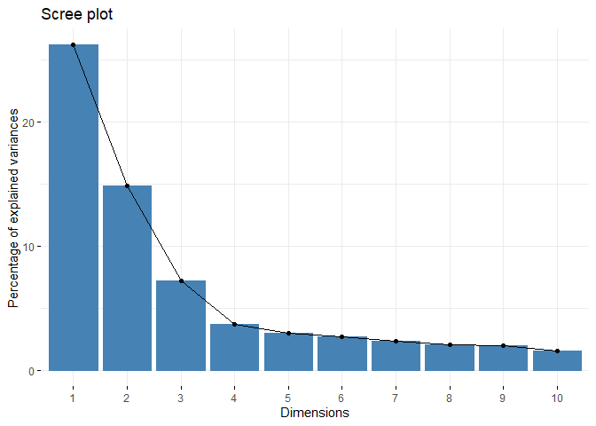
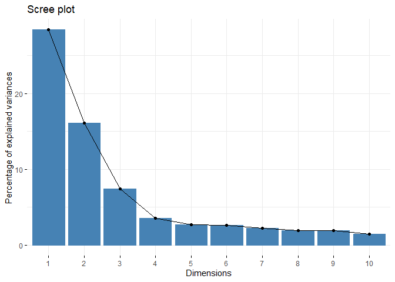

Differentially Methylated Genes Statistics
================
EL Strand

### Load libraries

``` r
# BiocManager::install("goseq")

library(plyr)
library(dplyr)
library(ggplot2)
library(tidyverse)
library(readxl)
library(plotrix) 
library(gridExtra)
library(seacarb) 
library(pheatmap)
library(tidyr)
library(gplots)
library(cowplot)
library(lsmeans)
library(data.table)
library(RColorBrewer)
library(randomcoloR)
library(ggpubr)
library(hrbrthemes)
library(viridis)
library(factoextra)
library(vegan)
library(Rmisc)
library(ggsignif)
library(ggpubr)
library(cowplot)
library("ComplexHeatmap")
```

## Load data

``` r
## filtered df has all loci 
load("data/WGBS/meth_table5x_filtered.RData")
load("data/WGBS/meth_table5x_filtered_sigDMG.RData")

## filtered2 = loci that have median methylation > 10%
load("data/WGBS/meth_table5x_filtered2.RData")  
load("data/WGBS/meth_table5x_filtered2_sigDMG.RData") 

## meta
load("data/metadata/meta.RData")

meth_group_list <- meth_table5x_filtered2 %>% dplyr::select(Sample.ID, meth_exp_group) %>% distinct()
```

## Calculating median loci methylation % per gene per sample

Done with loci \> 10% median methylation Figure made with DMGs

``` r
## Median from the filtered2 above
gene.stats <- meth_table5x_filtered2 %>%
  dplyr::group_by(Sample.ID, gene) %>%
  mutate(median.gene = median(per.meth),
         mean.gene = mean(per.meth)) %>% ungroup() %>%
  dplyr::group_by(Sample.ID) %>%
  mutate(median.sample = median(median.gene),
         mean.sample = mean(mean.gene)) %>% ungroup()

#gene.stats %>% dplyr::select(gene) %>% distinct()

gene.stats.DMGs <- meth_table5x_filtered2_sigDMG %>%
  dplyr::group_by(Sample.ID, gene) %>%
  mutate(median.gene = median(per.meth, na.rm=TRUE),
         mean.gene = mean(per.meth)) %>% ungroup() %>%
  dplyr::group_by(Sample.ID) %>%
  mutate(median.sample = median(median.gene),
         mean.sample = mean(mean.gene)) %>% ungroup()
  
fig2C <- gene.stats.DMGs %>% 
  subset(!meth_exp_group == "ungroup") %>%
    dplyr::select(Sample.ID, meth_exp_group, median.sample, mean.sample) %>% distinct() %>%
    ggplot(., aes(x=meth_exp_group, y=mean.sample, color=meth_exp_group)) + 
    geom_boxplot(outlier.shape=NA) +
    geom_jitter(size=3, alpha=0.7, width = 0.25) + 
    theme_bw() + 
    geom_signif(comparisons = list(c("D", "T1"), c("T1", "T2"), c("D","T2")), 
                annotations = "***", 
                y_position = c(67,63,69),
                color="grey30", 
                size = 0.5) + ## size = linewidth()
    ylab("CpG methylation level (%)") +
    #xlab("Ploidy Group") +
    xlab("") +
    labs(color = "Group") +
    scale_colour_manual(values = c("skyblue3", "olivedrab4", "darkgreen")) +
    scale_y_continuous(expand=expansion(mult=c(0.2,0.2))) +
    #annotate(geom = "text", x=0.5, y=0.9, label = "p < 0.0001", size=8, color="grey45") +
    theme(axis.text.x = element_text(size = 12, color = "black"),
          axis.text.y = element_text(size = 12, color = "black"),
          strip.background = element_rect(color="black", fill="white", linewidth=0.5, linetype="solid"),
          legend.position = "right",
          legend.text = element_text(size=12),
          axis.title.x = element_text(margin = margin(t=10,r=0,b=0,l=0), size=12, face="bold"),
          axis.title.y = element_text(margin = margin(t=0,r=10,b=0,l=0), size=12, face="bold"))
```

Statistics on the above

1225 2197

``` r
gene.stats.df <- gene.stats.DMGs %>% 
  dplyr::select(Sample.ID, meth_exp_group, median.sample, mean.sample) %>% distinct()
  
aov <- aov(mean.sample ~ meth_exp_group, data=gene.stats.df)
summary(aov)
```

    ##                Df Sum Sq Mean Sq F value Pr(>F)    
    ## meth_exp_group  2  429.4  214.70     122 <2e-16 ***
    ## Residuals      48   84.5    1.76                   
    ## ---
    ## Signif. codes:  0 '***' 0.001 '**' 0.01 '*' 0.05 '.' 0.1 ' ' 1

``` r
TukeyHSD(aov)
```

    ##   Tukey multiple comparisons of means
    ##     95% family-wise confidence level
    ## 
    ## Fit: aov(formula = mean.sample ~ meth_exp_group, data = gene.stats.df)
    ## 
    ## $meth_exp_group
    ##            diff       lwr        upr     p adj
    ## T1-D  -5.253955 -6.350006 -4.1579048 0.0000000
    ## T2-D  -7.192544 -8.345817 -6.0392699 0.0000000
    ## T2-T1 -1.938588 -3.014889 -0.8622881 0.0002019

## Plotting heatmap of DMGs with inidividual variability

`ploidy.meth.means.sigDMG` = significant DMGs. Mean CpG loci %
methylation per gene per sample.

``` r
## use for per sample heatmap 
heatmap.sample.df <- gene.stats %>% filter(!Sample.ID == "1225") %>% filter(!Sample.ID == "2197") %>%
    dplyr::select(Sample.ID, meth_exp_group, gene, mean.gene) %>% distinct() 

heatmap.sample.DMG.df <- gene.stats.DMGs %>% filter(!Sample.ID == "1225") %>% filter(!Sample.ID == "2197") %>%
    dplyr::select(Sample.ID, gene, meth_exp_group, mean.gene) %>% distinct() 

## use for ploidy group heatmap 
heatmap.group.df <- heatmap.sample.df %>% group_by(gene, meth_exp_group) %>%
  mutate(mean.group = mean(mean.gene)) %>% ungroup() %>% dplyr::select(-Sample.ID, -mean.gene) %>% distinct()

heatmap.group.DMG.df <- heatmap.sample.DMG.df %>% group_by(gene, meth_exp_group) %>%
  mutate(mean.group = mean(mean.gene)) %>% ungroup() %>% dplyr::select(-Sample.ID, -mean.gene) %>% distinct()

heatmap.sample.DMG.df %>% subset(meth_exp_group == "D") %>% dplyr::select(Sample.ID) %>% distinct()
```

    ## # A tibble: 15 × 1
    ##    Sample.ID
    ##    <chr>    
    ##  1 1047     
    ##  2 1159     
    ##  3 1168     
    ##  4 1281     
    ##  5 1296     
    ##  6 1303     
    ##  7 1329     
    ##  8 1416     
    ##  9 1487     
    ## 10 1571     
    ## 11 1755     
    ## 12 2212     
    ## 13 2668     
    ## 14 2861     
    ## 15 2879

``` r
All_data <- heatmap.sample.DMG.df %>% dplyr::select(-meth_exp_group) %>%
  #pivot_wider(names_from = c(meth_exp_group), values_from = mean.group)
  pivot_wider(names_from = c(Sample.ID), values_from = mean.gene)
All_mat <- as.matrix(All_data[,-1]) #create matrix and remove gene name 
group_order<-c("D", "T1", "T2")

par("mar")
```

    ## [1] 5.1 4.1 4.1 2.1

``` r
par(mar=c(1,1,1,1))

col_labels_df <- heatmap.sample.DMG.df %>% dplyr::select(Sample.ID, meth_exp_group) %>% distinct() %>%
  column_to_rownames(., var = "Sample.ID") %>%
  mutate(color = case_when(
    meth_exp_group == "D" ~ "skyblue3",
    meth_exp_group == "T1" ~ "olivedrab4",
    meth_exp_group == "T2" ~ "darkgreen"
  ))
col_labels <- col_labels_df$color

pdf("data/figures/Heatmap_samples_DMG.pdf")
heatmap_df<-
  heatmap.2(All_mat,
          cexCol = 1.5, 
          distfun = function(x) as.dist(1 - cor(t(x), use = "pa")), 
          hclustfun = function(x) hclust(x,method = 'average'),
          key.xtickfun = function() {
  breaks = pretty(parent.frame()$breaks)
  breaks = breaks[c(1,length(breaks))]
  list(at = parent.frame()$scale01(breaks),labels = breaks)},
  Colv=TRUE, 
  col= rev(RColorBrewer::brewer.pal(name = "RdYlBu", n = 10)), 
  density.info = "none", 
  ColSideColors=col_labels,
  dendrogram = "column",
  trace = "none", 
  scale = "row", 
  labRow = FALSE,
  labCol = FALSE,
  sepcolor="none",
  sepwidth=c(0.1,0.01),
  #lmat = rbind(4:3, 2:1),
    ### 5 = legend, 4 = col dend, 3 = row dend, 2 = heatmap, 1 = labels
  #lmat = rbind(c(4,3), c(0,1), c(2,1)),
  lmat = rbind(c(5,4), c(0,1), c(3,2)),
  keysize=0.1, 
  key.par = list(mgp = c(1.5, 0.5, 0), cex=0.7), 
  lhei=c(0.5,0.1,2),
  lwid = c(1.5,4))
dev.off()
```

    ## png 
    ##   2

``` r
## extracting data from heatmapdf
zscore_df <- as.data.frame(heatmap_df$carpet) ##carpet score is the zscore that goes into the heatmap
save(zscore_df, file = "data/WGBS/zscore.RData")
save(heatmap_df, file = "data/WGBS/Heatmap_output.RData")
save(All_data, file = "data/WGBS/Heatmap_input.RData")
```

## Principal Components Analysis & PERMANOVA

### ALL

## Creating matrix table

``` r
## Create summary means for loci > 10% median methylation and sigDMG genes 
pca.means.df <- aggregate(per.meth ~ gene*Sample.ID, data=meth_table5x_filtered2, FUN=mean)
pca.means.dfsig <- aggregate(per.meth ~ gene*Sample.ID, data=meth_table5x_filtered2_sigDMG, FUN=mean)

# transform df so column names are gene names 
All_data2 <- pca.means.df %>% 
  pivot_wider(names_from = gene, values_from = per.meth) %>%
  na.omit()

All_data2sig <- pca.means.dfsig %>% 
  pivot_wider(names_from = gene, values_from = per.meth) %>%
  na.omit()

rownames(All_data2) <- paste0(All_data2$Sample.ID)
```

    ## Warning: Setting row names on a tibble is deprecated.

``` r
rownames(All_data2sig) <- paste0(All_data2sig$Sample.ID)
```

    ## Warning: Setting row names on a tibble is deprecated.

## Running prcomp function

``` r
scaled_pca_all <-prcomp(All_data2[c(2:ncol(All_data2))], scale=FALSE, center=TRUE)
scaled_pca_sig <-prcomp(All_data2sig[c(2:ncol(All_data2sig))], scale=FALSE, center=TRUE)

fviz_eig(scaled_pca_all)
```

<!-- -->

``` r
fviz_eig(scaled_pca_sig)
```

<!-- -->

``` r
coral_info <- All_data2[c(1)]
coral_infosig <- All_data2sig[c(1)]

pca_data_all <- scaled_pca_all%>%
  broom::augment(coral_info)%>%
  group_by(Sample.ID)%>%
  mutate(PC1.mean = mean(.fittedPC1),
         PC2.mean = mean(.fittedPC2)) %>% ungroup()

pca_data_sig <- scaled_pca_sig%>%
  broom::augment(coral_infosig)%>%
  group_by(Sample.ID)%>%
  mutate(PC1.mean = mean(.fittedPC1),
         PC2.mean = mean(.fittedPC2)) %>% ungroup()
```

## Examine PERMANOVA results.

``` r
# scale data
vegan_all <- scale(All_data2[c(2:ncol(All_data2))])
vegan_sig <- scale(All_data2sig[c(2:ncol(All_data2sig))])

## adding metadata 
pca_data_all <- pca_data_all %>% left_join(., meta, by = "Sample.ID")
pca_data_sig <- pca_data_sig %>% left_join(., meta, by = "Sample.ID")

# PERMANOVA 
permanova_all <- adonis2(vegan_all ~ ploidy, 
                         data = pca_data_all, method='eu', permutations = 9999)
capture.output(permanova_all, file = "data/statistics/PERMANOVA_filtered2.txt")

permanova_sig <- adonis2(vegan_sig ~ ploidy, 
                         data = pca_data_sig, method='eu', permutations = 9999)
capture.output(permanova_sig, file = "data/statistics/PERMANOVA_filtered2_sigDMG.txt")
```

## Assemble plot with background points

``` r
#adding percentages on axis
names(pca_data_sig)[3] <- "PCA1"
names(pca_data_sig)[4] <- "PCA2"
names(pca_data_sig)[5] <- "PCA3"
names(pca_data_sig)[6] <- "PCA4"
percentage_sig <- round((scaled_pca_sig$sdev^2) / sum((scaled_pca_sig$sdev^2)) * 100, 2)
#percentage_sig <- paste(colnames(pca_data_sig[3:55]), "(",paste(as.character(pca_data_sig), "%", ")", sep="") )

## adding treatment column to visualize 
pca_data_sig$Sample.ID <- as.character(pca_data_sig$Sample.ID)
pca_data_sig <- pca_data_sig %>% left_join(., meth_group_list, by = "Sample.ID")

#adding percentages on axis
names(pca_data_all)[3] <- "PCA1"
names(pca_data_all)[4] <- "PCA2"
names(pca_data_all)[5] <- "PCA3"
names(pca_data_all)[6] <- "PCA4"
percentage_all <- round((scaled_pca_all$sdev^2) / sum((scaled_pca_all$sdev^2)) * 100, 2)
#percentage_all <- paste(colnames(pca_data_all[3:55]), "(",paste(as.character(pca_data_all), "%", ")", sep="") )

## adding treatment column to visualize 
pca_data_all$Sample.ID <- as.character(pca_data_all$Sample.ID)
pca_data_all <- pca_data_all %>% left_join(., meth_group_list, by = "Sample.ID")
```

Plotting by ploidy

``` r
ploidy_pca <- ggplot(pca_data_all, aes(PCA1, PCA2, color=meth_exp_group)) + #, label=Sample.ID
  geom_point(size = 4, aes(shape = ploidy)) +
  scale_colour_manual(values = c("skyblue3", "olivedrab4", "darkgreen")) +
  theme_bw()+
  scale_shape_manual(values=c(21, 17)) +
  ylab(paste("PCA2:", percentage_all[2], "%")) +
  xlab(paste("PCA1:", percentage_all[1], "%")) +
  labs(color = "Group", shape = "Ploidy") +
  theme(legend.text = element_text(size=12), 
        legend.position="right",
        plot.background = element_blank(),
        legend.title = element_text(size=12), 
        plot.margin = margin(1, 1, 1, 1, "cm"),
        axis.text = element_text(size=12),
        axis.title.x = element_text(margin = margin(t=10,r=0,b=0,l=0), size=12, face="bold"),
        axis.title.y = element_text(margin = margin(t=0,r=5,b=0,l=0), size=12, face="bold"))
```

Plot by environmental

``` r
treatment_pca <- ggplot(pca_data_all, aes(PCA1, PCA2, color=Treatment)) + 
  geom_point(size = 4, aes(shape = Timepoint)) +
  scale_colour_manual(values = c("blue", "lightblue", "salmon", "red3")) +
  theme_bw()+
  ylab(paste("PCA2:", percentage_all[2], "%")) +
  xlab(paste("PCA1:", percentage_all[1], "%")) +
  labs(color = "Treatment", shape = "Timepoint") +
  theme(legend.text = element_text(size=12), 
        legend.position="right",
        plot.background = element_blank(),
        legend.title = element_text(size=12), 
        plot.margin = margin(1, 1, 1, 1, "cm"),
        axis.text = element_text(size=12),
        axis.title.x = element_text(margin = margin(t=10,r=0,b=0,l=0), size=12, face="bold"),
        axis.title.y = element_text(margin = margin(t=0,r=10,b=0,l=0), size=12, face="bold"))
```

Plotting altogether for Figure 2

``` r
fig2_plots <- plot_grid(treatment_pca, ploidy_pca, fig2C,
          labels=c("A)", "B)", "C)"), 
          nrow=3, ncol=1,
          align="v", 
          axis=c("lrtb"),
          rel_widths = c(2, 2, 2),
          rel_heights = c(2,2,1.7),
          label_size = 18)

ggsave("data/figures/Fig2.jpeg", fig2_plots, width = 5, height = 10)
```
