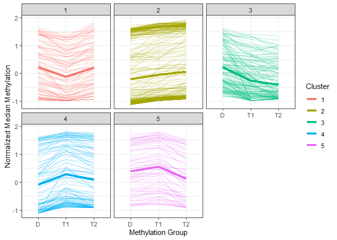
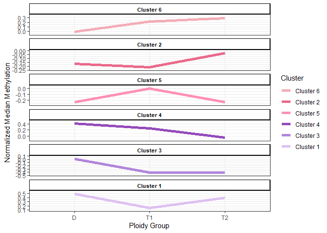

Hyper and hypo- methylated genes
================
EL Strand

# Hyper and hypo-methylated genes based on z-score of heatmap

## Load libraries

``` r
library(ggplot2)
library(tidyverse)
```

    ## ── Attaching core tidyverse packages ──────────────────────── tidyverse 2.0.0 ──
    ## ✔ dplyr     1.1.4     ✔ readr     2.1.5
    ## ✔ forcats   1.0.0     ✔ stringr   1.5.1
    ## ✔ lubridate 1.9.4     ✔ tibble    3.3.0
    ## ✔ purrr     1.1.0     ✔ tidyr     1.3.1
    ## ── Conflicts ────────────────────────────────────────── tidyverse_conflicts() ──
    ## ✖ dplyr::filter() masks stats::filter()
    ## ✖ dplyr::lag()    masks stats::lag()
    ## ℹ Use the conflicted package (<http://conflicted.r-lib.org/>) to force all conflicts to become errors

``` r
library(Biostrings)
```

    ## Loading required package: BiocGenerics
    ## 
    ## Attaching package: 'BiocGenerics'
    ## 
    ## The following objects are masked from 'package:lubridate':
    ## 
    ##     intersect, setdiff, union
    ## 
    ## The following objects are masked from 'package:dplyr':
    ## 
    ##     combine, intersect, setdiff, union
    ## 
    ## The following objects are masked from 'package:stats':
    ## 
    ##     IQR, mad, sd, var, xtabs
    ## 
    ## The following objects are masked from 'package:base':
    ## 
    ##     anyDuplicated, aperm, append, as.data.frame, basename, cbind,
    ##     colnames, dirname, do.call, duplicated, eval, evalq, Filter, Find,
    ##     get, grep, grepl, intersect, is.unsorted, lapply, Map, mapply,
    ##     match, mget, order, paste, pmax, pmax.int, pmin, pmin.int,
    ##     Position, rank, rbind, Reduce, rownames, sapply, setdiff, sort,
    ##     table, tapply, union, unique, unsplit, which.max, which.min
    ## 
    ## Loading required package: S4Vectors
    ## Loading required package: stats4
    ## 
    ## Attaching package: 'S4Vectors'
    ## 
    ## The following objects are masked from 'package:lubridate':
    ## 
    ##     second, second<-
    ## 
    ## The following objects are masked from 'package:dplyr':
    ## 
    ##     first, rename
    ## 
    ## The following object is masked from 'package:tidyr':
    ## 
    ##     expand
    ## 
    ## The following object is masked from 'package:utils':
    ## 
    ##     findMatches
    ## 
    ## The following objects are masked from 'package:base':
    ## 
    ##     expand.grid, I, unname
    ## 
    ## Loading required package: IRanges
    ## 
    ## Attaching package: 'IRanges'
    ## 
    ## The following object is masked from 'package:lubridate':
    ## 
    ##     %within%
    ## 
    ## The following objects are masked from 'package:dplyr':
    ## 
    ##     collapse, desc, slice
    ## 
    ## The following object is masked from 'package:purrr':
    ## 
    ##     reduce
    ## 
    ## The following object is masked from 'package:grDevices':
    ## 
    ##     windows
    ## 
    ## Loading required package: XVector
    ## 
    ## Attaching package: 'XVector'
    ## 
    ## The following object is masked from 'package:purrr':
    ## 
    ##     compact
    ## 
    ## Loading required package: GenomeInfoDb
    ## 
    ## Attaching package: 'Biostrings'
    ## 
    ## The following object is masked from 'package:base':
    ## 
    ##     strsplit

``` r
library(strex)
library(rstatix)
```

    ## 
    ## Attaching package: 'rstatix'
    ## 
    ## The following object is masked from 'package:IRanges':
    ## 
    ##     desc
    ## 
    ## The following object is masked from 'package:stats':
    ## 
    ##     filter

``` r
library("ComplexHeatmap")
```

    ## Loading required package: grid
    ## 
    ## Attaching package: 'grid'
    ## 
    ## The following object is masked from 'package:Biostrings':
    ## 
    ##     pattern
    ## 
    ## ========================================
    ## ComplexHeatmap version 2.16.0
    ## Bioconductor page: http://bioconductor.org/packages/ComplexHeatmap/
    ## Github page: https://github.com/jokergoo/ComplexHeatmap
    ## Documentation: http://jokergoo.github.io/ComplexHeatmap-reference
    ## 
    ## If you use it in published research, please cite either one:
    ## - Gu, Z. Complex Heatmap Visualization. iMeta 2022.
    ## - Gu, Z. Complex heatmaps reveal patterns and correlations in multidimensional 
    ##     genomic data. Bioinformatics 2016.
    ## 
    ## 
    ## The new InteractiveComplexHeatmap package can directly export static 
    ## complex heatmaps into an interactive Shiny app with zero effort. Have a try!
    ## 
    ## This message can be suppressed by:
    ##   suppressPackageStartupMessages(library(ComplexHeatmap))
    ## ========================================

``` r
library(gplots)
```

    ## 
    ## Attaching package: 'gplots'
    ## 
    ## The following object is masked from 'package:IRanges':
    ## 
    ##     space
    ## 
    ## The following object is masked from 'package:S4Vectors':
    ## 
    ##     space
    ## 
    ## The following object is masked from 'package:stats':
    ## 
    ##     lowess

``` r
library(RColorBrewer)
```

## Load data

``` r
load("data/WGBS/meth_table5x_filtered_sigDMG.RData")

meth_levels_gene <- meth_table5x_filtered_sigDMG %>%
  dplyr::group_by(gene) %>%
  reframe(median_meth = median(per.meth),
          mean_meth = mean(per.meth))

# Step 1: summarize by gene and group
gene_stats <- meth_table5x_filtered_sigDMG %>%
  dplyr::group_by(gene, meth_exp_group) %>%
  summarise(
    median_meth = median(per.meth),
    mean_meth   = mean(per.meth),
    .groups = "drop"
  )

# Step 2: identify genes where all groups have median > 0
genes_to_remove <- gene_stats %>%
  dplyr::group_by(gene) %>%
  summarise(all_pos = all(median_meth == 0), .groups = "drop") %>%
  filter(all_pos) %>%
  pull(gene)

# Step 3: drop those genes
meth_levels <- gene_stats %>%
  filter(!gene %in% genes_to_remove)

length(unique(meth_levels$gene))
```

    ## [1] 881

``` r
# Step 4: Find directional change 
# Assume meth_levels from before: gene, meth_exp_group, median_meth
# Step 1: wide format
wide <- meth_levels %>%
  select(gene, meth_exp_group, median_meth) %>%
  pivot_wider(names_from = meth_exp_group, values_from = median_meth)

# Step 2: normalize each group (z-score)
wide_norm <- wide %>%
  mutate(across(-gene, scale))

# Step 3: correlation and clustering
mat <- as.matrix(wide_norm[,-1])
row.names(mat) <- wide_norm$gene
corr <- cor(t(mat), use = "pairwise.complete.obs")
hc <- hclust(as.dist(1 - corr), method = "average")
clusters <- cutree(hc, k = 5)  # adjust cluster count as needed

wide_norm$cluster <- factor(clusters)

# Step 4: long form for plotting
wide_long <- wide_norm %>%
  pivot_longer(-c(gene, cluster), names_to = "meth_exp_group", values_to = "median_meth")

# Step 5: plot mean trend per cluster with gene-level lines
ggplot(wide_long, aes(x = meth_exp_group, y = median_meth, group = gene, color = cluster)) +
  geom_line(alpha = 0.3) +
  stat_summary(aes(group = cluster), fun = mean, geom = "line", linewidth = 1.5) +
  theme_bw() +
  facet_wrap(~cluster) +
  labs(x = "Methylation Group", y = "Normalized Median Methylation", color = "Cluster")
```

<!-- -->

## Create heatmap

``` r
# reshape data: genes × methylation groups
sub_heatmap <- meth_levels %>%
  select(-mean_meth) %>%
  pivot_wider(names_from = meth_exp_group, values_from = median_meth)

mat <- as.matrix(sub_heatmap %>% select(-gene))
rownames(mat) <- sub_heatmap$gene

# cluster genes by correlation
dist_mat <- as.dist(1 - cor(t(mat), use = "pairwise.complete.obs"))
hc_genes <- hclust(dist_mat, method = "average")

# optional: cluster samples (columns) too
hc_samples <- hclust(as.dist(1 - cor(mat, use = "pairwise.complete.obs")), method = "average")

# assign gene clusters (k = number of groups desired)
k <- 6
clusters <- cutree(hc_genes, k = k)
# row_colors <- RColorBrewer::brewer.pal(k, "Set1")[clusters]
my_colors  <- c("#dec0f1", 
                "#ea698b", 
                "#b185db",
                "#944bbb",
                "#ff90b3",
                "#f4acb7"
                )
row_colors <- my_colors[clusters]

col_colors_map <- c(
  "D"  = "skyblue3",
  "T1" = "olivedrab4",
  "T2" = "darkgreen"
)

# Match colors to matrix column order
col_labels <- col_colors_map[colnames(mat)]

# heatmap: cluster genes, optionally samples
pdf("data/figures/Directional_pattern.pdf")
sub_heatmap_df<-
heatmap.2(
  mat,
  Rowv = as.dendrogram(hc_genes),
  Colv = as.dendrogram(hc_samples),
  distfun = function(x) as.dist(1 - cor(t(x), use = "pairwise.complete.obs")),
  hclustfun = function(x) hclust(x, method = "average"),
  scale = "row",
  trace = "none",
  density.info = "none",
  col = rev(brewer.pal(name = "RdYlBu", n = 10)),
  RowSideColors = row_colors,
  ColSideColors = col_labels,   # column color bars
  labRow = FALSE,
  labCol = FALSE,
  key = TRUE,
  cexCol = 1.2,
  dendrogram = "row"
)
dev.off()
```

    ## png 
    ##   2

``` r
## Column orders of sample IDs in heatmap  
sub_colInd_df <- as.data.frame(sub_heatmap_df$colInd)
sub_sample_order <- wide %>% select(-gene) %>%
  gather(., "group", "value", 1:3) %>% select(-value) %>% distinct()
sub_sample_order$`sub_heatmap_df$colInd` <- c(1:3)
sub_colInd_df <- left_join(sub_colInd_df, sub_sample_order, by="sub_heatmap_df$colInd")

## Row orders of genes in heatmap 
# saving gene row ids to match to name and z score above 
sub_rowInd_df <- as.data.frame(sub_heatmap_df$rowInd)
sub_rowInd_df$gene <- c(1:881)
sub_rowInd_df$gene <- paste0("V", sub_rowInd_df$gene)

sub_All_data_gene_names <- wide 
sub_All_data_gene_names$rowInd <- c(1:881)

# sub_zscore_modified <- as.data.frame(sub_heatmap_df$carpet) %>% 
#   rownames_to_column(., var = "group") %>% na.omit() %>%
#   gather("gene", "zscore", 2:last_col()) %>%
#   left_join(., sub_rowInd_df, by = "gene") %>%
#   dplyr::rename(., rowInd = `sub_heatmap_df$rowInd`) %>% 
#   
#   #left_join(., All_data_gene_names %>% dplyr::select(rowInd, gene), by = ("rowInd")) %>% 
#   right_join(All_data_gene_names_subsetted %>% dplyr::select(rowInd, gene), ., by = ("rowInd")) %>%
#   
#   dplyr::rename(., gene_number = gene.y) %>%
#   dplyr::rename(., gene = gene.x) %>% 
#   left_join(., groups, by=c("Sample.ID")) 
```

``` r
gene_clusters <- data.frame(gene = names(clusters), cluster = clusters) %>% 
  mutate(cluster = paste0("Cluster ", cluster))

meth_levels_clusters <- meth_levels %>% left_join(., gene_clusters) %>% 
  mutate(cluster = as.character(cluster))
```

    ## Joining with `by = join_by(gene)`

``` r
meth_levels_clusters %>% dplyr::group_by(cluster) %>%
  reframe(n=n_distinct(gene))
```

    ## # A tibble: 6 × 2
    ##   cluster       n
    ##   <chr>     <int>
    ## 1 Cluster 1   125
    ## 2 Cluster 2    87
    ## 3 Cluster 3   247
    ## 4 Cluster 4   213
    ## 5 Cluster 5   135
    ## 6 Cluster 6    74

``` r
# plot_colors <- meth_levels_clusters %>% dplyr::select(cluster, color) %>% distinct()

meth_levels_clusters_ordered <- meth_levels_clusters %>%
  mutate(cluster = factor(cluster, levels = c("Cluster 6", "Cluster 2", "Cluster 5", "Cluster 4", 
                                              "Cluster 3", "Cluster 1")))

my_colors  <- c("#dec0f1", 
                "#ea698b", 
                "#b185db",
                "#944bbb",
                "#ff90b3",
                "#f4acb7"
                )

ggplot(meth_levels_clusters_ordered,
       aes(x = meth_exp_group, y = scale(median_meth), group = gene, color = cluster)) +
  stat_summary(aes(group = cluster), fun = mean, geom = "line", linewidth = 2) +
  theme_bw() +
  facet_wrap(~cluster, ncol = 1, scales="free_y") +
  scale_color_manual(values = c("Cluster 1"="#dec0f1", 
                                "Cluster 2"="#ea698b", 
                                "Cluster 3"="#b185db",
                                "Cluster 4"="#944bbb", 
                                "Cluster 5"="#ff90b3", 
                                "Cluster 6"="#f4acb7")) +
  scale_y_continuous(expand = expansion(mult = c(0.25, 0.25))) +
  labs(x = "Ploidy Group",
       y = "Normalized Median Methylation",
       color = "Cluster") +
  theme(
    strip.background = element_rect(fill = "white", color = "black", linewidth = 1),
    strip.text = element_text(size = 8, face = "bold", color = "black")
  )
```

<!-- -->

``` r
ggsave("data/figures/Directional_pattern_summary.png", width=3, height=6)
```

## Load data from sig meth dataframe for STRING

``` r
Cluster1_genes <- gene_clusters %>% subset(cluster=="Cluster 1") %>% pull(gene) ##125 genes
Cluster2_genes <- gene_clusters %>% subset(cluster=="Cluster 2") %>% pull(gene) ##87 genes
Cluster3_genes <- gene_clusters %>% subset(cluster=="Cluster 3") %>% pull(gene) ##247 genes
Cluster4_genes <- gene_clusters %>% subset(cluster=="Cluster 4") %>% pull(gene) ##213 genes
Cluster5_genes <- gene_clusters %>% subset(cluster=="Cluster 5") %>% pull(gene) ##135 genes
Cluster6_genes <- gene_clusters %>% subset(cluster=="Cluster 6") %>% pull(gene) ##74 genes

### protein fasta file 
fasta_file <- "data/Pocillopora_acuta_HIv2.genes.pep.faa.gz"
protein_sequences <- readAAStringSet(fasta_file)
names(protein_sequences) <- sub("-.*", "", names(protein_sequences))

Cluster1_matched_sequences <- protein_sequences[names(protein_sequences) %in% Cluster1_genes] 
Cluster2_matched_sequences <- protein_sequences[names(protein_sequences) %in% Cluster2_genes] 
Cluster3_matched_sequences <- protein_sequences[names(protein_sequences) %in% Cluster3_genes] 
Cluster4_matched_sequences <- protein_sequences[names(protein_sequences) %in% Cluster4_genes] 
Cluster5_matched_sequences <- protein_sequences[names(protein_sequences) %in% Cluster5_genes] 
Cluster6_matched_sequences <- protein_sequences[names(protein_sequences) %in% Cluster6_genes] 

writeXStringSet(Cluster1_matched_sequences, "data/WGBS/GOenrich/Cluster1_matched_sequences.fasta")
writeXStringSet(Cluster2_matched_sequences, "data/WGBS/GOenrich/Cluster2_matched_sequences.fasta")
writeXStringSet(Cluster3_matched_sequences, "data/WGBS/GOenrich/Cluster3_matched_sequences.fasta")
writeXStringSet(Cluster4_matched_sequences, "data/WGBS/GOenrich/Cluster4_matched_sequences.fasta")
writeXStringSet(Cluster5_matched_sequences, "data/WGBS/GOenrich/Cluster5_matched_sequences.fasta")
writeXStringSet(Cluster6_matched_sequences, "data/WGBS/GOenrich/Cluster6_matched_sequences.fasta")
```

## Load data

``` r
# load("data/WGBS/heatmap/zscore.RData") ## zscore_df
# load("data/WGBS/heatmap/Heatmap_output.RData") ## heatmap_df
# load("data/WGBS/heatmap/Heatmap_input.RData") ## All_data
# 
# groups <- read.csv("data/metadata/meth_pattern_groups.csv") %>% dplyr::select(-X)
# groups$Sample.ID <- as.character(groups$Sample.ID)
```

## Calculating z-score and hypermethylayed / hypomethylated groups

Ordering samples in df

``` r
# ## Column orders of sample IDs in heatmap  
# colInd_df <- as.data.frame(heatmap_df$colInd)
# 
# sample_order <- All_data %>% select(-gene) %>%
#   gather(., "Sample.ID", "value", 1:51) %>% select(-value) %>% distinct()
# sample_order$`heatmap_df$colInd` <- c(1:51)
# 
# colInd_df <- left_join(colInd_df, sample_order, by="heatmap_df$colInd") %>% 
#   left_join(., groups, by = "Sample.ID")
# 
# ## Row orders of genes in heatmap 
# # saving gene row ids to match to name and z score above 
# rowInd_df <- as.data.frame(heatmap_df$rowInd)
# rowInd_df$gene <- c(1:3692)
# rowInd_df$gene <- paste0("V", rowInd_df$gene)
# 
# ## testing z score output to double check order of the gene names above 
# ## number below is the first row under rowInd above
# test <- All_data[269,] 
# test <- test %>% gather("Sample.ID", "value", 2:52) %>% na.omit() ##2:4 for meth_exp_group
# test <- test %>% mutate(mean = mean(value),
#                         stdev = sd(value),
#                         zscore = (value-mean)/stdev)
# 
# ## confirmed that V1 is the first row of rowInd_df which is row 642 in All_data  
# ## next steps is to bind rowInd_df with the row id and then the gene name from All_data
# All_data_gene_names <- All_data 
# All_data_gene_names$rowInd <- c(1:3692)
# #All_data_gene_names$rowInd <- as.character(All_data_gene_names$rowInd)
```

Subsetting this list based on the filtering

``` r
# All_data_gene_names_subsetted <- All_data_gene_names %>%
#   filter(gene %in% meth_levels$gene)
```

``` r
# zscore_modified <- zscore_df %>% 
#   rownames_to_column(., var = "Sample.ID") %>% na.omit() %>%
#   gather("gene", "zscore", 2:last_col()) %>%
#   left_join(., rowInd_df, by = "gene") %>%
#   dplyr::rename(., rowInd = `heatmap_df$rowInd`) %>%
#   #left_join(., All_data_gene_names %>% dplyr::select(rowInd, gene), by = ("rowInd")) %>% 
#   right_join(All_data_gene_names_subsetted %>% dplyr::select(rowInd, gene), ., by = ("rowInd")) %>%
#   
#   dplyr::rename(., gene_number = gene.y) %>%
#   dplyr::rename(., gene = gene.x) %>% 
#   left_join(., groups, by=c("Sample.ID")) 
# 
# ### calculating median zscore per group
# zscore_median <- zscore_modified %>% group_by(meth_exp_group, gene) %>%
#   mutate(med_zscore = median(zscore)) %>% dplyr::select(gene, meth_exp_group, med_zscore) %>% distinct() %>%
#   spread(meth_exp_group, med_zscore)
# 
# # Genes that are hypermethylated in Triploidy 2 (and not in Triploidy 1 or Diploidy) = 101 genes
# hypermeth_trip2 <- zscore_median %>% filter(T2 > 0.75) 
# # Genes that are hypermethylated in Triploidy 1 (and not in Triploidy 2 or Diploidy)  = 70 genes
# hypermeth_trip1 <- zscore_median %>% filter(T1 > 0.75) 
# # Genes that are hypermethylated in Diploidy (and not in Triploidy 2 or Triploidy 1)  = 415 genes
# hypermeth_dip <- zscore_median %>% filter(D > 0.75) 
# 
# # Genes that are hypomethylated in Triploidy 2 (and not in Triploidy 1 or Diploidy) = 272 genes
# hypometh_trip2 <- zscore_median %>% filter(T2 < -0.75) 
# # Genes that are hypomethylated in Triploidy 1 (and not in Triploidy 2 or Diploidy)  = 140 genes
# hypometh_trip1 <- zscore_median %>% filter(T1 < -0.75) 
# # Genes that are hypomethylated in Diploidy (and not in Triploidy 2 or Triploidy 1)  = 143 genes
# hypometh_dip <- zscore_median %>% filter(D < -0.75) 
# 
# hypermeth_trip2 %>% write.csv("data/WGBS/hyper-hypo methylation/DMG_hypermeth_triploidy2.csv", row.names = FALSE)
# hypermeth_trip1 %>% write.csv("data/WGBS/hyper-hypo methylation/DMG_hypermeth_triploidy1.csv", row.names = FALSE)
# hypermeth_dip %>% write.csv("data/WGBS/hyper-hypo methylation/DMG_hypermeth_diploidy.csv", row.names = FALSE)
# 
# hypometh_trip2 %>% write.csv("data/WGBS/hyper-hypo methylation/DMG_hypometh_triploidy2.csv", row.names = FALSE)
# hypometh_trip1 %>% write.csv("data/WGBS/hyper-hypo methylation/DMG_hypometh_triploidy1.csv", row.names = FALSE)
# hypometh_dip %>% write.csv("data/WGBS/hyper-hypo methylation/DMG_hypometh_diploidy.csv", row.names = FALSE)
```

Plotting the hyper-meth/hypo-meth levels above

``` r
# subset_gene_list <- hypometh_dip
# 
# ## statistics on the above 
# ngenes = nrow(subset_gene_list)
# hypermeth_stats <- subset_gene_list %>% gather("group", "zscore", 2:last_col())
# 
# aov <- aov(zscore ~ group, data=hypermeth_stats)
# summary(aov)
# TukeyHSD(aov)
# 
# subset_gene_list %>%
#     
#   gather("group", "zscore", 2:last_col()) %>%
#   ggplot(., aes(x=group, y=zscore, color=group)) + theme_bw() + 
#   labs(
#     x="Ploidy Group",
#     color="Ploidy Group"
#   ) +
#   ggtitle(
#     label = paste0("n = ", ngenes, " genes"),
#     subtitle = "ANOVA p-value = <2e-16"
#   ) +
#   geom_boxplot(outlier.shape=NA) + geom_jitter(size=1, alpha=0.3, width=0.2) +
#   
#   scale_colour_manual(values = c("skyblue3", "olivedrab4", "darkgreen")) +
#   
#   theme(legend.position = "none",
#         panel.background=element_rect(fill='white', colour='black'),
#         axis.text.y = element_text(size=10, color="grey30"),
#         axis.text.x = element_text(size=10, color="grey30"),
#         plot.title = element_text(size=10, color="grey55", face = "italic"),
#         plot.subtitle = element_text(size=10, color="grey55", face = "italic"),
#         axis.title.y = element_text(margin = margin(t = 0, r = 10, b = 0, l = 0), size=12, face="bold"),
#         axis.title.x = element_text(margin = margin(t = 10, r = 0, b = 0, l = 0), size=12, face="bold"))
# 
# ggsave(filename="data/figures/Supplemental Figure 4 Zscore_hypometh_diploidy.jpeg", dpi=300, width=3.5, height=5, units="in")
```
