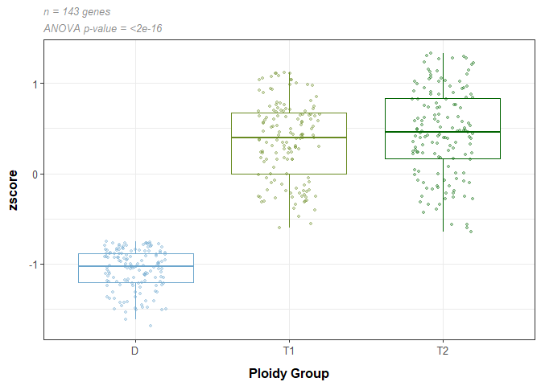

Hyper and hypo- methylated genes
================
EL Strand

# Hyper and hypo-methylated genes based on z-score of heatmap

## Load libraries

``` r
library(ggplot2)
library(tidyverse)
```

    ## ── Attaching core tidyverse packages ──────────────────────── tidyverse 2.0.0 ──
    ## ✔ dplyr     1.1.4     ✔ readr     2.1.5
    ## ✔ forcats   1.0.0     ✔ stringr   1.5.1
    ## ✔ lubridate 1.9.3     ✔ tibble    3.2.1
    ## ✔ purrr     1.0.2     ✔ tidyr     1.3.1
    ## ── Conflicts ────────────────────────────────────────── tidyverse_conflicts() ──
    ## ✖ dplyr::filter() masks stats::filter()
    ## ✖ dplyr::lag()    masks stats::lag()
    ## ℹ Use the conflicted package (<http://conflicted.r-lib.org/>) to force all conflicts to become errors

## Load data

``` r
load("data/WGBS/heatmap/zscore.RData") ## zscore_df
load("data/WGBS/heatmap/Heatmap_output.RData") ## heatmap_df
load("data/WGBS/heatmap/Heatmap_input.RData") ## All_data

groups <- read.csv("data/metadata/meth_pattern_groups.csv") %>% dplyr::select(-X)
groups$Sample.ID <- as.character(groups$Sample.ID)
```

## Calculating z-score and hypermethylayed / hypomethylated groups

Ordering samples in df

``` r
## Column orders of sample IDs in heatmap  
colInd_df <- as.data.frame(heatmap_df$colInd)

sample_order <- All_data %>% select(-gene) %>%
  gather(., "Sample.ID", "value", 1:51) %>% select(-value) %>% distinct()
sample_order$`heatmap_df$colInd` <- c(1:51)

colInd_df <- left_join(colInd_df, sample_order, by="heatmap_df$colInd") %>% 
  left_join(., groups, by = "Sample.ID")

## Row orders of genes in heatmap 
# saving gene row ids to match to name and z score above 
rowInd_df <- as.data.frame(heatmap_df$rowInd)
rowInd_df$gene <- c(1:1447)
rowInd_df$gene <- paste0("V", rowInd_df$gene)

## testing z score output to double check order of the gene names above 
## number below is the first row under rowInd above
test <- All_data[269,] 
test <- test %>% gather("Sample.ID", "value", 2:52) %>% na.omit() ##2:4 for meth_exp_group
test <- test %>% mutate(mean = mean(value),
                        stdev = sd(value),
                        zscore = (value-mean)/stdev)

## confirmed that V1 is the first row of rowInd_df which is row 642 in All_data  
## next steps is to bind rowInd_df with the row id and then the gene name from All_data
All_data_gene_names <- All_data 
All_data_gene_names$rowInd <- c(1:1447)
#All_data_gene_names$rowInd <- as.character(All_data_gene_names$rowInd)
```

``` r
zscore_modified <- zscore_df %>% 
  rownames_to_column(., var = "Sample.ID") %>% na.omit() %>%
  gather("gene", "zscore", 2:last_col()) %>%
  left_join(., rowInd_df, by = "gene") %>%
  dplyr::rename(., rowInd = `heatmap_df$rowInd`) %>%
  left_join(., All_data_gene_names %>% dplyr::select(rowInd, gene), by = ("rowInd")) %>% 
  dplyr::rename(., gene_number = gene.x) %>%
  dplyr::rename(., gene = gene.y) %>% 
  left_join(., groups, by=c("Sample.ID")) 

### calculating median zscore per group
zscore_median <- zscore_modified %>% group_by(meth_exp_group, gene) %>%
  mutate(med_zscore = median(zscore)) %>% dplyr::select(gene, meth_exp_group, med_zscore) %>% distinct() %>%
  spread(meth_exp_group, med_zscore)

# Genes that are hypermethylated in Triploidy 2 (and not in Triploidy 1 or Diploidy) = 101 genes
hypermeth_trip2 <- zscore_median %>% filter(T2 > 0.75) 
# Genes that are hypermethylated in Triploidy 1 (and not in Triploidy 2 or Diploidy)  = 70 genes
hypermeth_trip1 <- zscore_median %>% filter(T1 > 0.75) 
# Genes that are hypermethylated in Diploidy (and not in Triploidy 2 or Triploidy 1)  = 415 genes
hypermeth_dip <- zscore_median %>% filter(D > 0.75) 

# Genes that are hypomethylated in Triploidy 2 (and not in Triploidy 1 or Diploidy) = 272 genes
hypometh_trip2 <- zscore_median %>% filter(T2 < -0.75) 
# Genes that are hypomethylated in Triploidy 1 (and not in Triploidy 2 or Diploidy)  = 140 genes
hypometh_trip1 <- zscore_median %>% filter(T1 < -0.75) 
# Genes that are hypomethylated in Diploidy (and not in Triploidy 2 or Triploidy 1)  = 143 genes
hypometh_dip <- zscore_median %>% filter(D < -0.75) 

hypermeth_trip2 %>% write.csv("data/WGBS/hyper-hypo methylation/DMG_hypermeth_triploidy2.csv", row.names = FALSE)
hypermeth_trip1 %>% write.csv("data/WGBS/hyper-hypo methylation/DMG_hypermeth_triploidy1.csv", row.names = FALSE)
hypermeth_dip %>% write.csv("data/WGBS/hyper-hypo methylation/DMG_hypermeth_diploidy.csv", row.names = FALSE)

hypometh_trip2 %>% write.csv("data/WGBS/hyper-hypo methylation/DMG_hypometh_triploidy2.csv", row.names = FALSE)
hypometh_trip1 %>% write.csv("data/WGBS/hyper-hypo methylation/DMG_hypometh_triploidy1.csv", row.names = FALSE)
hypometh_dip %>% write.csv("data/WGBS/hyper-hypo methylation/DMG_hypometh_diploidy.csv", row.names = FALSE)
```

Plotting the hyper-meth/hypo-meth levels above

``` r
subset_gene_list <- hypometh_dip

## statistics on the above 
ngenes = nrow(subset_gene_list)
hypermeth_stats <- subset_gene_list %>% gather("group", "zscore", 2:last_col())

aov <- aov(zscore ~ group, data=hypermeth_stats)
summary(aov)
```

    ##              Df Sum Sq Mean Sq F value Pr(>F)    
    ## group         2 207.17  103.58   664.3 <2e-16 ***
    ## Residuals   426  66.42    0.16                   
    ## ---
    ## Signif. codes:  0 '***' 0.001 '**' 0.01 '*' 0.05 '.' 0.1 ' ' 1

``` r
TukeyHSD(aov)
```

    ##   Tukey multiple comparisons of means
    ##     95% family-wise confidence level
    ## 
    ## Fit: aov(formula = zscore ~ group, data = hypermeth_stats)
    ## 
    ## $group
    ##             diff         lwr       upr     p adj
    ## T1-D  1.42803007  1.31820014 1.5378600 0.0000000
    ## T2-D  1.51627521  1.40644528 1.6261051 0.0000000
    ## T2-T1 0.08824514 -0.02158478 0.1980751 0.1428783

``` r
subset_gene_list %>%
    
  gather("group", "zscore", 2:last_col()) %>%
  ggplot(., aes(x=group, y=zscore, color=group)) + theme_bw() + 
  labs(
    x="Ploidy Group",
    color="Ploidy Group"
  ) +
  ggtitle(
    label = paste0("n = ", ngenes, " genes"),
    subtitle = "ANOVA p-value = <2e-16"
  ) +
  geom_boxplot(outlier.shape=NA) + geom_jitter(size=1, alpha=0.3, width=0.2) +
  
  scale_colour_manual(values = c("skyblue3", "olivedrab4", "darkgreen")) +
  
  theme(legend.position = "none",
        panel.background=element_rect(fill='white', colour='black'),
        axis.text.y = element_text(size=10, color="grey30"),
        axis.text.x = element_text(size=10, color="grey30"),
        plot.title = element_text(size=10, color="grey55", face = "italic"),
        plot.subtitle = element_text(size=10, color="grey55", face = "italic"),
        axis.title.y = element_text(margin = margin(t = 0, r = 10, b = 0, l = 0), size=12, face="bold"),
        axis.title.x = element_text(margin = margin(t = 10, r = 0, b = 0, l = 0), size=12, face="bold"))
```

<!-- -->

``` r
ggsave(filename="data/figures/Supplemental Figure 4 Zscore_hypometh_diploidy.jpeg", dpi=300, width=3.5, height=5, units="in")
```
