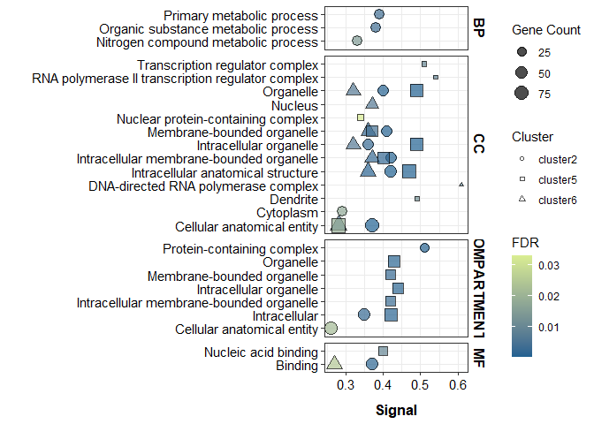
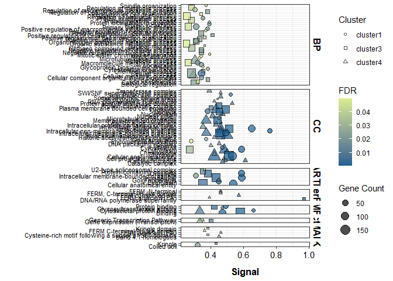

GO Enrichment of cluster genes
================
EL Strand

# Hyper and hypo-methylated genes based on z-score of heatmap

## Load libraries

``` r
library(ggplot2)
library(tidyverse)
```

    ## ── Attaching core tidyverse packages ──────────────────────── tidyverse 2.0.0 ──
    ## ✔ dplyr     1.1.4     ✔ readr     2.1.5
    ## ✔ forcats   1.0.0     ✔ stringr   1.5.1
    ## ✔ lubridate 1.9.4     ✔ tibble    3.3.0
    ## ✔ purrr     1.1.0     ✔ tidyr     1.3.1
    ## ── Conflicts ────────────────────────────────────────── tidyverse_conflicts() ──
    ## ✖ dplyr::filter() masks stats::filter()
    ## ✖ dplyr::lag()    masks stats::lag()
    ## ℹ Use the conflicted package (<http://conflicted.r-lib.org/>) to force all conflicts to become errors

``` r
library(Biostrings)
```

    ## Loading required package: BiocGenerics
    ## 
    ## Attaching package: 'BiocGenerics'
    ## 
    ## The following objects are masked from 'package:lubridate':
    ## 
    ##     intersect, setdiff, union
    ## 
    ## The following objects are masked from 'package:dplyr':
    ## 
    ##     combine, intersect, setdiff, union
    ## 
    ## The following objects are masked from 'package:stats':
    ## 
    ##     IQR, mad, sd, var, xtabs
    ## 
    ## The following objects are masked from 'package:base':
    ## 
    ##     anyDuplicated, aperm, append, as.data.frame, basename, cbind,
    ##     colnames, dirname, do.call, duplicated, eval, evalq, Filter, Find,
    ##     get, grep, grepl, intersect, is.unsorted, lapply, Map, mapply,
    ##     match, mget, order, paste, pmax, pmax.int, pmin, pmin.int,
    ##     Position, rank, rbind, Reduce, rownames, sapply, setdiff, sort,
    ##     table, tapply, union, unique, unsplit, which.max, which.min
    ## 
    ## Loading required package: S4Vectors
    ## Loading required package: stats4
    ## 
    ## Attaching package: 'S4Vectors'
    ## 
    ## The following objects are masked from 'package:lubridate':
    ## 
    ##     second, second<-
    ## 
    ## The following objects are masked from 'package:dplyr':
    ## 
    ##     first, rename
    ## 
    ## The following object is masked from 'package:tidyr':
    ## 
    ##     expand
    ## 
    ## The following object is masked from 'package:utils':
    ## 
    ##     findMatches
    ## 
    ## The following objects are masked from 'package:base':
    ## 
    ##     expand.grid, I, unname
    ## 
    ## Loading required package: IRanges
    ## 
    ## Attaching package: 'IRanges'
    ## 
    ## The following object is masked from 'package:lubridate':
    ## 
    ##     %within%
    ## 
    ## The following objects are masked from 'package:dplyr':
    ## 
    ##     collapse, desc, slice
    ## 
    ## The following object is masked from 'package:purrr':
    ## 
    ##     reduce
    ## 
    ## The following object is masked from 'package:grDevices':
    ## 
    ##     windows
    ## 
    ## Loading required package: XVector
    ## 
    ## Attaching package: 'XVector'
    ## 
    ## The following object is masked from 'package:purrr':
    ## 
    ##     compact
    ## 
    ## Loading required package: GenomeInfoDb
    ## 
    ## Attaching package: 'Biostrings'
    ## 
    ## The following object is masked from 'package:base':
    ## 
    ##     strsplit

``` r
library(strex)
library(rstatix)
```

    ## 
    ## Attaching package: 'rstatix'
    ## 
    ## The following object is masked from 'package:IRanges':
    ## 
    ##     desc
    ## 
    ## The following object is masked from 'package:stats':
    ## 
    ##     filter

``` r
library("ComplexHeatmap")
```

    ## Loading required package: grid
    ## 
    ## Attaching package: 'grid'
    ## 
    ## The following object is masked from 'package:Biostrings':
    ## 
    ##     pattern
    ## 
    ## ========================================
    ## ComplexHeatmap version 2.16.0
    ## Bioconductor page: http://bioconductor.org/packages/ComplexHeatmap/
    ## Github page: https://github.com/jokergoo/ComplexHeatmap
    ## Documentation: http://jokergoo.github.io/ComplexHeatmap-reference
    ## 
    ## If you use it in published research, please cite either one:
    ## - Gu, Z. Complex Heatmap Visualization. iMeta 2022.
    ## - Gu, Z. Complex heatmaps reveal patterns and correlations in multidimensional 
    ##     genomic data. Bioinformatics 2016.
    ## 
    ## 
    ## The new InteractiveComplexHeatmap package can directly export static 
    ## complex heatmaps into an interactive Shiny app with zero effort. Have a try!
    ## 
    ## This message can be suppressed by:
    ##   suppressPackageStartupMessages(library(ComplexHeatmap))
    ## ========================================

``` r
library(gplots)
```

    ## 
    ## Attaching package: 'gplots'
    ## 
    ## The following object is masked from 'package:IRanges':
    ## 
    ##     space
    ## 
    ## The following object is masked from 'package:S4Vectors':
    ## 
    ##     space
    ## 
    ## The following object is masked from 'package:stats':
    ## 
    ##     lowess

``` r
library(RColorBrewer)
library(ggh4x) ## for facet wrap options
```

## Load data

``` r
cluster1 <- read.delim2("data/WGBS/GOenrich/Cluster1_enrichment_terms_0.7sim.tsv") %>% mutate(cluster="cluster1") #%>%
  #subset(!X.category == "COMPARTMENTS") %>% subset(!X.category == "UniProt Keywords")
cluster2 <- read.delim2("data/WGBS/GOenrich/Cluster2_enrichment_terms.tsv") %>% mutate(cluster="cluster2")# %>%
  #subset(!X.category == "COMPARTMENTS") %>% subset(!X.category == "UniProt Keywords")
cluster3 <- read.delim2("data/WGBS/GOenrich/Cluster3_enrichment_terms_0.7sim.tsv") %>% mutate(cluster="cluster3") #%>%
  #subset(!X.category == "COMPARTMENTS") %>% subset(!X.category == "UniProt Keywords")
cluster4 <- read.delim2("data/WGBS/GOenrich/Cluster4_enrichment_terms_0.7sim.tsv") %>% mutate(cluster="cluster4") #%>%
  #subset(!X.category == "COMPARTMENTS") %>% subset(!X.category == "UniProt Keywords")
cluster5 <- read.delim2("data/WGBS/GOenrich/Cluster5_enrichment_terms.tsv") %>% mutate(cluster="cluster5") #%>%
  #subset(!X.category == "COMPARTMENTS") %>% subset(!X.category == "UniProt Keywords")
cluster6 <- read.delim2("data/WGBS/GOenrich/Cluster6_enrichment_terms.tsv") %>% mutate(cluster="cluster6") #%>%
 #subset(!X.category == "COMPARTMENTS") %>% subset(!X.category == "UniProt Keywords")
```

## Group by pattern

``` r
triploid <- full_join(cluster6, cluster2) %>% full_join(cluster5)
```

    ## Joining with `by = join_by(X.category, term.ID, term.description,
    ## observed.gene.count, background.gene.count, strength, signal,
    ## false.discovery.rate, matching.proteins.in.your.network..IDs.,
    ## matching.proteins.in.your.network..labels., cluster)`
    ## Joining with `by = join_by(X.category, term.ID, term.description,
    ## observed.gene.count, background.gene.count, strength, signal,
    ## false.discovery.rate, matching.proteins.in.your.network..IDs.,
    ## matching.proteins.in.your.network..labels., cluster)`

``` r
diploid <- full_join(cluster4, cluster3) %>% full_join(cluster1)
```

    ## Joining with `by = join_by(X.category, term.ID, term.description,
    ## observed.gene.count, background.gene.count, strength, signal,
    ## false.discovery.rate, matching.proteins.in.your.network..IDs.,
    ## matching.proteins.in.your.network..labels., cluster)`
    ## Joining with `by = join_by(X.category, term.ID, term.description,
    ## observed.gene.count, background.gene.count, strength, signal,
    ## false.discovery.rate, matching.proteins.in.your.network..IDs.,
    ## matching.proteins.in.your.network..labels., cluster)`

``` r
triploid <- triploid %>% dplyr::select(X.category, cluster, term.description, observed.gene.count,
                                      background.gene.count, strength, signal, false.discovery.rate) %>%
  mutate(false.discovery.rate = as.numeric(false.discovery.rate),
         strength = as.numeric(strength),
         signal = as.numeric(signal)
         )  %>%
  mutate(group = "triploid") %>%
  mutate(X.category = case_when(
    X.category == "GO Component" ~ "CC",
    X.category == "GO Function" ~ "MF",
    X.category == "GO Process" ~ "BP",
    TRUE ~ X.category
    ))
  

diploid <- diploid %>% dplyr::select(X.category, cluster, term.description, observed.gene.count,
                                      background.gene.count, strength, signal, false.discovery.rate) %>%
    mutate(false.discovery.rate = as.numeric(false.discovery.rate),
         strength = as.numeric(strength),
         signal = as.numeric(signal)
         ) %>%
  mutate(group = "diploid") %>%
    mutate(X.category = case_when(
    X.category == "GO Component" ~ "CC",
    X.category == "GO Function" ~ "MF",
    X.category == "GO Process" ~ "BP",
    TRUE ~ X.category
    ))
```

``` r
triploid %>%
  ggplot(., aes(x=signal, y=term.description)) +
  geom_point(aes(size=observed.gene.count, fill=false.discovery.rate, shape=cluster), alpha=0.7) +
  
  scale_shape_manual(values = c(21, 22, 24)) +
  scale_fill_gradient(low="#1e6091", high="#d9ed92") +
  
  labs(
    y = "",
    x = "Signal",
    fill = "FDR",
    size = "Gene Count",
    shape = "Cluster"
  ) +
  
  facet_grid2(X.category ~ ., scales = "free", space = "free") +
  theme_bw() +
  theme(
    ## facet wrap labels
    strip.text.x = element_text(color = "black", face = "bold", size = 12),
    strip.text.y = element_text(color = "black", face = "bold", size = 12),
    strip.background.y = element_blank(),
    strip.clip = "off",
    
    axis.text.y = element_text(size=11, color="black"),
    axis.text.x = element_text(size=11, color="black"),
    axis.title.y = element_text(margin = margin(t = 0, r = 10, b = 0, l = 0), size=13, face="bold"),
    axis.title.x = element_text(margin = margin(t = 10, r = 0, b = 0, l = 0), size=13, face="bold")
  )
```

<!-- -->

``` r
ggsave("data/figures/Triploidy_enrichment.png", width=9, height=5.5)
```

``` r
diploid %>%
  ggplot(., aes(x=signal, y=term.description)) +
  geom_point(aes(size=observed.gene.count, fill=false.discovery.rate, shape=cluster), alpha=0.7) +
  
  scale_shape_manual(values = c(21, 22, 24)) +
  scale_fill_gradient(low="#1e6091", high="#d9ed92") +
  
  labs(
    y = "",
    x = "Signal",
    fill = "FDR",
    size = "Gene Count",
    shape = "Cluster"
  ) +
  
  facet_grid2(X.category ~ ., scales = "free", space = "free") +
  theme_bw() +
  theme(
    ## facet wrap labels
    strip.text.x = element_text(color = "black", face = "bold", size = 12),
    strip.text.y = element_text(color = "black", face = "bold", size = 12),
    strip.background.y = element_blank(),
    strip.clip = "off",
    
    axis.text.y = element_text(size=8, color="black"),
    axis.text.x = element_text(size=11, color="black"),
    axis.title.y = element_text(margin = margin(t = 0, r = 10, b = 0, l = 0), size=13, face="bold"),
    axis.title.x = element_text(margin = margin(t = 10, r = 0, b = 0, l = 0), size=13, face="bold")
  )
```

<!-- -->

``` r
ggsave("data/figures/Diploid_enrichment.png", width=7, height=14)
```
