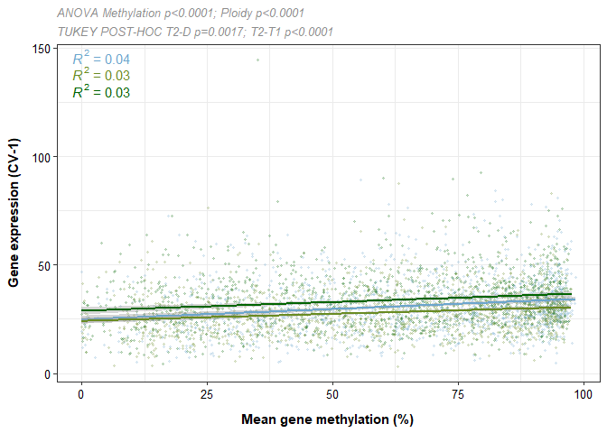

Targeted gene expression
================
EL Strand

## Load libraries

``` r
library(plyr)
library(dplyr)
```

    ## 
    ## Attaching package: 'dplyr'

    ## The following objects are masked from 'package:plyr':
    ## 
    ##     arrange, count, desc, failwith, id, mutate, rename, summarise,
    ##     summarize

    ## The following objects are masked from 'package:stats':
    ## 
    ##     filter, lag

    ## The following objects are masked from 'package:base':
    ## 
    ##     intersect, setdiff, setequal, union

``` r
library(ggplot2)
library("RColorBrewer")
library("tidyverse")
```

    ## ── Attaching core tidyverse packages ──────────────────────── tidyverse 2.0.0 ──
    ## ✔ forcats   1.0.0     ✔ stringr   1.5.1
    ## ✔ lubridate 1.9.3     ✔ tibble    3.2.1
    ## ✔ purrr     1.0.2     ✔ tidyr     1.3.1
    ## ✔ readr     2.1.5

    ## ── Conflicts ────────────────────────────────────────── tidyverse_conflicts() ──
    ## ✖ dplyr::arrange()   masks plyr::arrange()
    ## ✖ purrr::compact()   masks plyr::compact()
    ## ✖ dplyr::count()     masks plyr::count()
    ## ✖ dplyr::desc()      masks plyr::desc()
    ## ✖ dplyr::failwith()  masks plyr::failwith()
    ## ✖ dplyr::filter()    masks stats::filter()
    ## ✖ dplyr::id()        masks plyr::id()
    ## ✖ dplyr::lag()       masks stats::lag()
    ## ✖ dplyr::mutate()    masks plyr::mutate()
    ## ✖ dplyr::rename()    masks plyr::rename()
    ## ✖ dplyr::summarise() masks plyr::summarise()
    ## ✖ dplyr::summarize() masks plyr::summarize()
    ## ℹ Use the conflicted package (<http://conflicted.r-lib.org/>) to force all conflicts to become errors

``` r
library("ggpubr")
```

    ## 
    ## Attaching package: 'ggpubr'
    ## 
    ## The following object is masked from 'package:plyr':
    ## 
    ##     mutate

``` r
library("DESeq2")
```

    ## Loading required package: S4Vectors
    ## Loading required package: stats4
    ## Loading required package: BiocGenerics
    ## 
    ## Attaching package: 'BiocGenerics'
    ## 
    ## The following objects are masked from 'package:lubridate':
    ## 
    ##     intersect, setdiff, union
    ## 
    ## The following objects are masked from 'package:dplyr':
    ## 
    ##     combine, intersect, setdiff, union
    ## 
    ## The following objects are masked from 'package:stats':
    ## 
    ##     IQR, mad, sd, var, xtabs
    ## 
    ## The following objects are masked from 'package:base':
    ## 
    ##     anyDuplicated, aperm, append, as.data.frame, basename, cbind,
    ##     colnames, dirname, do.call, duplicated, eval, evalq, Filter, Find,
    ##     get, grep, grepl, intersect, is.unsorted, lapply, Map, mapply,
    ##     match, mget, order, paste, pmax, pmax.int, pmin, pmin.int,
    ##     Position, rank, rbind, Reduce, rownames, sapply, setdiff, sort,
    ##     table, tapply, union, unique, unsplit, which.max, which.min
    ## 
    ## 
    ## Attaching package: 'S4Vectors'
    ## 
    ## The following objects are masked from 'package:lubridate':
    ## 
    ##     second, second<-
    ## 
    ## The following object is masked from 'package:tidyr':
    ## 
    ##     expand
    ## 
    ## The following objects are masked from 'package:dplyr':
    ## 
    ##     first, rename
    ## 
    ## The following object is masked from 'package:plyr':
    ## 
    ##     rename
    ## 
    ## The following object is masked from 'package:utils':
    ## 
    ##     findMatches
    ## 
    ## The following objects are masked from 'package:base':
    ## 
    ##     expand.grid, I, unname
    ## 
    ## Loading required package: IRanges
    ## 
    ## Attaching package: 'IRanges'
    ## 
    ## The following object is masked from 'package:lubridate':
    ## 
    ##     %within%
    ## 
    ## The following object is masked from 'package:purrr':
    ## 
    ##     reduce
    ## 
    ## The following objects are masked from 'package:dplyr':
    ## 
    ##     collapse, desc, slice
    ## 
    ## The following object is masked from 'package:plyr':
    ## 
    ##     desc
    ## 
    ## The following object is masked from 'package:grDevices':
    ## 
    ##     windows
    ## 
    ## Loading required package: GenomicRanges
    ## Loading required package: GenomeInfoDb
    ## Loading required package: SummarizedExperiment
    ## Loading required package: MatrixGenerics
    ## Loading required package: matrixStats
    ## 
    ## Attaching package: 'matrixStats'
    ## 
    ## The following object is masked from 'package:dplyr':
    ## 
    ##     count
    ## 
    ## The following object is masked from 'package:plyr':
    ## 
    ##     count
    ## 
    ## 
    ## Attaching package: 'MatrixGenerics'
    ## 
    ## The following objects are masked from 'package:matrixStats':
    ## 
    ##     colAlls, colAnyNAs, colAnys, colAvgsPerRowSet, colCollapse,
    ##     colCounts, colCummaxs, colCummins, colCumprods, colCumsums,
    ##     colDiffs, colIQRDiffs, colIQRs, colLogSumExps, colMadDiffs,
    ##     colMads, colMaxs, colMeans2, colMedians, colMins, colOrderStats,
    ##     colProds, colQuantiles, colRanges, colRanks, colSdDiffs, colSds,
    ##     colSums2, colTabulates, colVarDiffs, colVars, colWeightedMads,
    ##     colWeightedMeans, colWeightedMedians, colWeightedSds,
    ##     colWeightedVars, rowAlls, rowAnyNAs, rowAnys, rowAvgsPerColSet,
    ##     rowCollapse, rowCounts, rowCummaxs, rowCummins, rowCumprods,
    ##     rowCumsums, rowDiffs, rowIQRDiffs, rowIQRs, rowLogSumExps,
    ##     rowMadDiffs, rowMads, rowMaxs, rowMeans2, rowMedians, rowMins,
    ##     rowOrderStats, rowProds, rowQuantiles, rowRanges, rowRanks,
    ##     rowSdDiffs, rowSds, rowSums2, rowTabulates, rowVarDiffs, rowVars,
    ##     rowWeightedMads, rowWeightedMeans, rowWeightedMedians,
    ##     rowWeightedSds, rowWeightedVars
    ## 
    ## Loading required package: Biobase
    ## Welcome to Bioconductor
    ## 
    ##     Vignettes contain introductory material; view with
    ##     'browseVignettes()'. To cite Bioconductor, see
    ##     'citation("Biobase")', and for packages 'citation("pkgname")'.
    ## 
    ## 
    ## Attaching package: 'Biobase'
    ## 
    ## The following object is masked from 'package:MatrixGenerics':
    ## 
    ##     rowMedians
    ## 
    ## The following objects are masked from 'package:matrixStats':
    ## 
    ##     anyMissing, rowMedians

``` r
library("genefilter")
```

    ## 
    ## Attaching package: 'genefilter'
    ## 
    ## The following objects are masked from 'package:MatrixGenerics':
    ## 
    ##     rowSds, rowVars
    ## 
    ## The following objects are masked from 'package:matrixStats':
    ## 
    ##     rowSds, rowVars
    ## 
    ## The following object is masked from 'package:readr':
    ## 
    ##     spec

``` r
library(Rmisc)
```

    ## Loading required package: lattice

``` r
library(lme4)
```

    ## Loading required package: Matrix
    ## 
    ## Attaching package: 'Matrix'
    ## 
    ## The following object is masked from 'package:S4Vectors':
    ## 
    ##     expand
    ## 
    ## The following objects are masked from 'package:tidyr':
    ## 
    ##     expand, pack, unpack

``` r
library(car)
```

    ## Loading required package: carData
    ## 
    ## Attaching package: 'car'
    ## 
    ## The following object is masked from 'package:genefilter':
    ## 
    ##     Anova
    ## 
    ## The following object is masked from 'package:purrr':
    ## 
    ##     some
    ## 
    ## The following object is masked from 'package:dplyr':
    ## 
    ##     recode

``` r
library(purrr)
library(lubridate)
library(Hmisc)
```

    ## 
    ## Attaching package: 'Hmisc'
    ## 
    ## The following object is masked from 'package:Biobase':
    ## 
    ##     contents
    ## 
    ## The following objects are masked from 'package:dplyr':
    ## 
    ##     src, summarize
    ## 
    ## The following objects are masked from 'package:plyr':
    ## 
    ##     is.discrete, summarize
    ## 
    ## The following objects are masked from 'package:base':
    ## 
    ##     format.pval, units

``` r
library(naniar)
library(stats)
library(forcats)
library(data.table)
```

    ## 
    ## Attaching package: 'data.table'
    ## 
    ## The following object is masked from 'package:SummarizedExperiment':
    ## 
    ##     shift
    ## 
    ## The following object is masked from 'package:GenomicRanges':
    ## 
    ##     shift
    ## 
    ## The following object is masked from 'package:IRanges':
    ## 
    ##     shift
    ## 
    ## The following objects are masked from 'package:S4Vectors':
    ## 
    ##     first, second
    ## 
    ## The following objects are masked from 'package:lubridate':
    ## 
    ##     hour, isoweek, mday, minute, month, quarter, second, wday, week,
    ##     yday, year
    ## 
    ## The following object is masked from 'package:purrr':
    ## 
    ##     transpose
    ## 
    ## The following objects are masked from 'package:dplyr':
    ## 
    ##     between, first, last

``` r
library(writexl)
library(ggpmisc)
```

    ## Loading required package: ggpp
    ## Registered S3 methods overwritten by 'ggpp':
    ##   method                  from   
    ##   heightDetails.titleGrob ggplot2
    ##   widthDetails.titleGrob  ggplot2
    ## 
    ## Attaching package: 'ggpp'
    ## 
    ## The following objects are masked from 'package:ggpubr':
    ## 
    ##     as_npc, as_npcx, as_npcy
    ## 
    ## The following object is masked from 'package:ggplot2':
    ## 
    ##     annotate

``` r
library(multcomp)
```

    ## Loading required package: mvtnorm
    ## Loading required package: survival
    ## Loading required package: TH.data
    ## Loading required package: MASS
    ## 
    ## Attaching package: 'MASS'
    ## 
    ## The following object is masked from 'package:genefilter':
    ## 
    ##     area
    ## 
    ## The following object is masked from 'package:dplyr':
    ## 
    ##     select
    ## 
    ## 
    ## Attaching package: 'TH.data'
    ## 
    ## The following object is masked from 'package:MASS':
    ## 
    ##     geyser

``` r
library("genefilter")
library("DESeq2")
library("RColorBrewer")
library("WGCNA")
```

    ## Loading required package: dynamicTreeCut
    ## Loading required package: fastcluster
    ## 
    ## Attaching package: 'fastcluster'
    ## 
    ## The following object is masked from 'package:stats':
    ## 
    ##     hclust
    ## 
    ## 
    ## 
    ## Attaching package: 'WGCNA'
    ## 
    ## The following object is masked from 'package:IRanges':
    ## 
    ##     cor
    ## 
    ## The following object is masked from 'package:S4Vectors':
    ## 
    ##     cor
    ## 
    ## The following object is masked from 'package:stats':
    ## 
    ##     cor

``` r
library("flashClust")
```

    ## 
    ## Attaching package: 'flashClust'
    ## 
    ## The following object is masked from 'package:fastcluster':
    ## 
    ##     hclust
    ## 
    ## The following object is masked from 'package:stats':
    ## 
    ##     hclust

``` r
library("gridExtra")
```

    ## 
    ## Attaching package: 'gridExtra'
    ## 
    ## The following object is masked from 'package:Biobase':
    ## 
    ##     combine
    ## 
    ## The following object is masked from 'package:BiocGenerics':
    ## 
    ##     combine
    ## 
    ## The following object is masked from 'package:dplyr':
    ## 
    ##     combine

``` r
library("ComplexHeatmap")
```

    ## Loading required package: grid
    ## ========================================
    ## ComplexHeatmap version 2.16.0
    ## Bioconductor page: http://bioconductor.org/packages/ComplexHeatmap/
    ## Github page: https://github.com/jokergoo/ComplexHeatmap
    ## Documentation: http://jokergoo.github.io/ComplexHeatmap-reference
    ## 
    ## If you use it in published research, please cite either one:
    ## - Gu, Z. Complex Heatmap Visualization. iMeta 2022.
    ## - Gu, Z. Complex heatmaps reveal patterns and correlations in multidimensional 
    ##     genomic data. Bioinformatics 2016.
    ## 
    ## 
    ## The new InteractiveComplexHeatmap package can directly export static 
    ## complex heatmaps into an interactive Shiny app with zero effort. Have a try!
    ## 
    ## This message can be suppressed by:
    ##   suppressPackageStartupMessages(library(ComplexHeatmap))
    ## ========================================
    ## 
    ## 
    ## Attaching package: 'ComplexHeatmap'
    ## 
    ## The following object is masked from 'package:genefilter':
    ## 
    ##     dist2

``` r
library("goseq")
```

    ## Loading required package: BiasedUrn
    ## Loading required package: geneLenDataBase
    ## 
    ## Attaching package: 'geneLenDataBase'
    ## 
    ## The following object is masked from 'package:S4Vectors':
    ## 
    ##     unfactor

``` r
library("dplyr")
library("clusterProfiler")
```

    ## Registered S3 methods overwritten by 'treeio':
    ##   method              from    
    ##   MRCA.phylo          tidytree
    ##   MRCA.treedata       tidytree
    ##   Nnode.treedata      tidytree
    ##   Ntip.treedata       tidytree
    ##   ancestor.phylo      tidytree
    ##   ancestor.treedata   tidytree
    ##   child.phylo         tidytree
    ##   child.treedata      tidytree
    ##   full_join.phylo     tidytree
    ##   full_join.treedata  tidytree
    ##   groupClade.phylo    tidytree
    ##   groupClade.treedata tidytree
    ##   groupOTU.phylo      tidytree
    ##   groupOTU.treedata   tidytree
    ##   inner_join.phylo    tidytree
    ##   inner_join.treedata tidytree
    ##   is.rooted.treedata  tidytree
    ##   nodeid.phylo        tidytree
    ##   nodeid.treedata     tidytree
    ##   nodelab.phylo       tidytree
    ##   nodelab.treedata    tidytree
    ##   offspring.phylo     tidytree
    ##   offspring.treedata  tidytree
    ##   parent.phylo        tidytree
    ##   parent.treedata     tidytree
    ##   root.treedata       tidytree
    ##   rootnode.phylo      tidytree
    ##   sibling.phylo       tidytree
    ## clusterProfiler v4.8.3  For help: https://yulab-smu.top/biomedical-knowledge-mining-book/
    ## 
    ## If you use clusterProfiler in published research, please cite:
    ## T Wu, E Hu, S Xu, M Chen, P Guo, Z Dai, T Feng, L Zhou, W Tang, L Zhan, X Fu, S Liu, X Bo, and G Yu. clusterProfiler 4.0: A universal enrichment tool for interpreting omics data. The Innovation. 2021, 2(3):100141
    ## 
    ## Attaching package: 'clusterProfiler'
    ## 
    ## The following object is masked from 'package:MASS':
    ## 
    ##     select
    ## 
    ## The following object is masked from 'package:lattice':
    ## 
    ##     dotplot
    ## 
    ## The following object is masked from 'package:IRanges':
    ## 
    ##     slice
    ## 
    ## The following object is masked from 'package:S4Vectors':
    ## 
    ##     rename
    ## 
    ## The following object is masked from 'package:purrr':
    ## 
    ##     simplify
    ## 
    ## The following objects are masked from 'package:plyr':
    ## 
    ##     arrange, mutate, rename, summarise
    ## 
    ## The following object is masked from 'package:stats':
    ## 
    ##     filter

``` r
library("pheatmap")
```

    ## 
    ## Attaching package: 'pheatmap'
    ## 
    ## The following object is masked from 'package:ComplexHeatmap':
    ## 
    ##     pheatmap

``` r
library("magrittr")
```

    ## 
    ## Attaching package: 'magrittr'
    ## 
    ## The following object is masked from 'package:GenomicRanges':
    ## 
    ##     subtract
    ## 
    ## The following object is masked from 'package:purrr':
    ## 
    ##     set_names
    ## 
    ## The following object is masked from 'package:tidyr':
    ## 
    ##     extract

``` r
library("reshape2")
```

    ## 
    ## Attaching package: 'reshape2'
    ## 
    ## The following objects are masked from 'package:data.table':
    ## 
    ##     dcast, melt
    ## 
    ## The following object is masked from 'package:tidyr':
    ## 
    ##     smiths

``` r
library(readxl)
```

## Load data

``` r
GEdata <- read.delim("data/gene expression/Pocillopora_acuta_KBHIv2.gentrome.fa.gz.salmon.numreads.matrix") %>%
  dplyr::rename(gene_id = Name) %>% gather(., "Sample.ID", "count", 2:120) %>%
  mutate(Sample.ID = str_remove(Sample.ID, ".*_")) 

meta <- read.csv("data/metadata/meth_pattern_groups.csv") %>% dplyr::select(-X) %>%
  mutate(Sample.ID = as.character(Sample.ID)) 

GEdata_filtered <- GEdata %>% filter(Sample.ID %in% meta$Sample.ID) %>%
  spread(., Sample.ID, count) %>%
  mutate(gene_id = str_replace_all(gene_id, "KB", ""))
```

## Data filtering: PoverA and genefilter

Conduct data filtering, this includes:

*pOverA*: Specifying the minimum count for a proportion of samples for
each gene. Filter in the package “genefilter”. Pre-filtering our dataset
to reduce the memory size dataframe, increase the speed of the
transformation and testing functions, and improve quality of statistical
analysis by removing low-coverage counts. Removed counts could represent
outliers in the data and removing these improves sensitivity of
statistical tests.

### Pacuta

**Methylation pattern group**: Here, we are using a pOverA of 0.294.
This is because we have 51 samples with a minimum of n=15 samples per
group. Therefore, we will accept genes that are present in 15/51 = 0.294
of the samples because we expect different expression by ploidy. We are
further setting the minimum percentage of genes to 1, such that 29.4% of
the samples must have a counts minimum of 10.

``` r
Pacuta_matrix <- GEdata_filtered %>% column_to_rownames(., var = "gene_id")
Pfilt <- filterfun(pOverA(0.294,10))

#create filter for the counts data
Pgfilt <- genefilter(Pacuta_matrix, Pfilt)

#identify genes to keep by count filter
Pkeep <- Pacuta_matrix[Pgfilt,]

#identify gene lists
Pn.keep <- rownames(Pkeep)

#gene count data filtered in PoverA, P percent of the samples have counts over A
Pacuta_data_filt <- as.data.frame(Pacuta_matrix[which(rownames(Pacuta_matrix) %in% Pn.keep),])

#How many rows do we have before and after filtering?
nrow(Pacuta_matrix) #Before = 33,259
```

    ## [1] 33259

``` r
nrow(Pacuta_data_filt) #After = 19,128 for ploidy 
```

    ## [1] 19128

``` r
#Filtering removed 14,131 in ploidy analysis 
```

In order for the DESeq2 algorithms to work, the SampleIDs on the
treatmentinfo file and count matrices have to match exactly and in the
same order. The following R clump will check to make sure that these
match.

``` r
#Checking that all row and column names match. Should return "TRUE"
all(meta$Sample.ID %in% colnames(Pacuta_data_filt))
```

    ## [1] TRUE

``` r
all(meta$Sample.ID == colnames(Pacuta_data_filt)) 
```

    ## [1] TRUE

## Read normalization

We are now going normalize our read counts using VST-normalization in
DESeq2

### Construct the DESeq2 dataset

Create a DESeqDataSet design from gene count matrix and labels. Here we
set the design to look at time_point to test for any differences in gene
expression across timepoints.

``` r
Pacuta_gdds_dev <- DESeqDataSetFromMatrix(countData = round(Pacuta_data_filt),
                              colData = meta,
                              design = ~meth_exp_group)
```

    ## converting counts to integer mode

    ## Warning in DESeqDataSet(se, design = design, ignoreRank): some variables in
    ## design formula are characters, converting to factors

``` r
## combine DESeq matrix so can directly compare and normalize them together 
pacuta_forall <- Pacuta_data_filt %>% 
  rownames_to_column(., var="gene_id") %>%
  gather(., "Sample.ID", "count", 2:52) #120 for all pacuta 

all_data_filt <- pacuta_forall %>% 
  spread(., Sample.ID, count) %>%
  column_to_rownames(., var="gene_id")
```

#### Log-transform the count data

First we are going to log-transform the data using a variance
stabilizing transforamtion (VST). This is only for visualization
purposes. Essentially, this is roughly similar to putting the data on
the log2 scale. It will deal with the sampling variability of low counts
by calculating within-group variability (if blind=FALSE). Importantly,
it does not use the design to remove variation in the data, and so can
be used to examine if there may be any variability do to technical
factors such as extraction batch effects.

To do this we first need to calculate the size factors of our samples.
This is a rough estimate of how many reads each sample contains compared
to the others. In order to use VST (the faster log2 transforming
process) to log-transform our data, the size factors need to be less
than 4. Otherwise, there could be artefacts in our results.

``` r
Pacuta_SF.gdds_dev <- estimateSizeFactors(Pacuta_gdds_dev) #estimate size factors to determine if we can use vst  to transform our data. Size factors should be less than four to use vst
print(sizeFactors(Pacuta_SF.gdds_dev)) #View size factors
```

    ##      1047      1051      1090      1103      1147      1159      1168      1184 
    ## 1.0600297 0.9512191 0.9318231 0.9499388 0.9897337 0.7861643 1.0192703 1.0254375 
    ##      1238      1281      1296      1303      1329      1416      1427      1459 
    ## 1.2016075 1.0133464 0.8951596 0.7810593 1.7878638 1.1044230 1.1715002 0.8154479 
    ##      1487      1536      1559      1563      1571      1582      1596      1641 
    ## 0.8391506 0.9317340 1.0462176 1.2727722 1.0622321 1.3457162 1.4008365 0.8716652 
    ##      1647      1707      1709      1728      1732      1755      1757      1765 
    ## 0.8945071 1.0200240 1.3763394 0.9774126 1.1428589 0.9142802 0.9090385 0.7837225 
    ##      1777      1820      2012      2064      2072      2087      2212      2300 
    ## 0.7237128 0.7977061 1.0540367 1.0738678 0.5476178 1.3100646 1.1010608 1.3255433 
    ##      2304      2306      2409      2413      2513      2564      2668      2861 
    ## 1.2559678 0.8159483 1.2750923 0.8897233 0.7386891 1.2223804 1.2070374 1.0683110 
    ##      2877      2878      2879 
    ## 0.9918296 0.9705756 1.0024758

Our size factors are all less than 4, so we can use VST!

``` r
Pacuta_gvst_dev <- vst(Pacuta_gdds_dev, blind=FALSE) #apply a variance stabilizing transforamtion to minimize effects of small counts and normalize wrt library size
head(assay(Pacuta_gvst_dev), 3) #view transformed gene count data
```

    ##                                             1047     1051      1090      1103
    ## Pocillopora_acuta_HIv2___RNAseq.10002_t 6.364838 6.183118  6.287703  6.386129
    ## Pocillopora_acuta_HIv2___RNAseq.10010_t 7.616137 7.267985  7.563832  8.356152
    ## Pocillopora_acuta_HIv2___RNAseq.10171_t 9.628161 8.545416 11.158024 10.065207
    ##                                              1147     1159     1168      1184
    ## Pocillopora_acuta_HIv2___RNAseq.10002_t  6.597865 5.942072 6.455214  7.318984
    ## Pocillopora_acuta_HIv2___RNAseq.10010_t  8.049777 8.281067 8.617689  7.758823
    ## Pocillopora_acuta_HIv2___RNAseq.10171_t 11.677559 9.568368 9.708319 10.119745
    ##                                             1238      1281     1296     1303
    ## Pocillopora_acuta_HIv2___RNAseq.10002_t 6.600768  6.357652 6.520693 6.683893
    ## Pocillopora_acuta_HIv2___RNAseq.10010_t 7.865265  6.862130 8.434678 8.472675
    ## Pocillopora_acuta_HIv2___RNAseq.10171_t 9.367854 11.153719 7.917978 9.116847
    ##                                              1329      1416     1427      1459
    ## Pocillopora_acuta_HIv2___RNAseq.10002_t  6.186585  6.597925 6.575934  6.637493
    ## Pocillopora_acuta_HIv2___RNAseq.10010_t  7.467079  7.967787 7.958476  7.561322
    ## Pocillopora_acuta_HIv2___RNAseq.10171_t 10.929665 11.248135 8.650559 10.161304
    ##                                             1487     1536     1559      1563
    ## Pocillopora_acuta_HIv2___RNAseq.10002_t 6.494091 6.367567 6.214516  5.745151
    ## Pocillopora_acuta_HIv2___RNAseq.10010_t 8.085778 7.620443 8.196733  8.006576
    ## Pocillopora_acuta_HIv2___RNAseq.10171_t 5.915489 9.870449 9.932703 11.339961
    ##                                             1571      1582      1596     1641
    ## Pocillopora_acuta_HIv2___RNAseq.10002_t 6.445412  6.339054  6.186104 5.688678
    ## Pocillopora_acuta_HIv2___RNAseq.10010_t 8.007301  7.560257  7.075243 7.890326
    ## Pocillopora_acuta_HIv2___RNAseq.10171_t 8.481086 10.386458 10.977235 9.373879
    ##                                              1647     1707     1709     1728
    ## Pocillopora_acuta_HIv2___RNAseq.10002_t  6.220164 6.534999 6.530301 6.757634
    ## Pocillopora_acuta_HIv2___RNAseq.10010_t  7.606136 7.860231 7.486200 6.999465
    ## Pocillopora_acuta_HIv2___RNAseq.10171_t 10.435953 8.903619 9.668528 8.447037
    ##                                             1732     1755      1757     1765
    ## Pocillopora_acuta_HIv2___RNAseq.10002_t 6.867604 6.585476  5.846136 5.912748
    ## Pocillopora_acuta_HIv2___RNAseq.10010_t 8.019825 7.667564  8.241156 7.893144
    ## Pocillopora_acuta_HIv2___RNAseq.10171_t 9.193536 9.004186 10.394451 8.901051
    ##                                             1777     1820     2012     2064
    ## Pocillopora_acuta_HIv2___RNAseq.10002_t 6.253416 5.929183 6.992045 6.150464
    ## Pocillopora_acuta_HIv2___RNAseq.10010_t 8.212904 7.352635 8.191720 7.406388
    ## Pocillopora_acuta_HIv2___RNAseq.10171_t 9.666345 8.877070 7.952218 9.508624
    ##                                             2072      2087      2212      2300
    ## Pocillopora_acuta_HIv2___RNAseq.10002_t 6.535869  6.716738  5.659219  6.522082
    ## Pocillopora_acuta_HIv2___RNAseq.10010_t 7.682675  8.277725  7.739037  7.415260
    ## Pocillopora_acuta_HIv2___RNAseq.10171_t 9.732780 11.193144 10.756836 10.152492
    ##                                             2304      2306      2409     2413
    ## Pocillopora_acuta_HIv2___RNAseq.10002_t 6.846507  5.668751  5.914181 6.664302
    ## Pocillopora_acuta_HIv2___RNAseq.10010_t 7.964939  7.148025  7.912963 7.445003
    ## Pocillopora_acuta_HIv2___RNAseq.10171_t 9.420227 10.189505 11.411927 8.638835
    ##                                             2513      2564      2668      2861
    ## Pocillopora_acuta_HIv2___RNAseq.10002_t 6.456750  5.910409  5.587516  6.562041
    ## Pocillopora_acuta_HIv2___RNAseq.10010_t 7.340418  7.730811  7.885137  8.092197
    ## Pocillopora_acuta_HIv2___RNAseq.10171_t 9.652494 10.278922 10.625838 10.260231
    ##                                              2877     2878      2879
    ## Pocillopora_acuta_HIv2___RNAseq.10002_t  6.923177 6.806485  6.067285
    ## Pocillopora_acuta_HIv2___RNAseq.10010_t  8.261834 7.841374  7.767618
    ## Pocillopora_acuta_HIv2___RNAseq.10171_t 11.275720 7.941888 10.270544

``` r
## create data matrix 
pacuta_counts <- as.data.frame(assay(Pacuta_gvst_dev)) 
```

## Gene expression counts and CV versus DNA methylation levels

Read in methylation data and transform counts, methylation level, and
expression CV.

This uses the mean but I could switch this to the median. The mean is
more representative after removing the loci with 0 % methylation.

``` r
### Methylation data 
gene.stats.DMGs <- read.csv("data/WGBS/DMG_statistics.csv") %>% 
  dplyr::select(Sample.ID, gene, median.gene, mean.gene) %>% distinct() %>%
  mutate(Sample.ID = as.character(Sample.ID)) 

### Gene expression data 
GE.stats.formeth <- pacuta_counts %>% 
  rownames_to_column(., var="gene") %>%
  gather("Sample.ID", "count", 2:52) %>% filter(!is.na(count))  

EXP_METH_compare <- full_join(gene.stats.DMGs, GE.stats.formeth, by = c("Sample.ID", "gene")) %>%
  left_join(., meta, by = "Sample.ID") %>% na.omit() %>% gather("measurement", "value", 3:5)

comparison_summary <- summarySE(EXP_METH_compare, measurevar = c("value"), 
                               groupvars = c("measurement", "gene", "meth_exp_group"))

comparison_summary_GE <- comparison_summary %>% filter(measurement == "count") %>%
  dplyr::select(gene, meth_exp_group, value, sd) %>% dplyr::rename(count = value) %>% dplyr::rename(count_sd = sd)

comparison_summary_meth <- comparison_summary %>% filter(measurement == "mean.gene") %>% 
  dplyr::select(gene, meth_exp_group, value, sd) %>% dplyr::rename(per.meth = value) %>% dplyr::rename(meth_sd = sd) 

comparison_summary2 <- full_join(comparison_summary_GE, comparison_summary_meth, by = c("gene", "meth_exp_group")) %>%
  mutate(CV = (count_sd/count),
         inv_CV = (1/CV),
         log_expression = log10(count+1)) %>%
  filter_all(all_vars(!is.infinite(.)))
```

Methylation vs. Gene expression

``` r
### statistic
ANOVA <- aov(count~meth_exp_group*per.meth, data = comparison_summary2)
summary(ANOVA)
```

    ##                           Df Sum Sq Mean Sq F value Pr(>F)    
    ## meth_exp_group             2      2    1.18   0.518  0.596    
    ## per.meth                   1    244  243.63 107.104 <2e-16 ***
    ## meth_exp_group:per.meth    2      5    2.32   1.019  0.361    
    ## Residuals               3909   8892    2.27                   
    ## ---
    ## Signif. codes:  0 '***' 0.001 '**' 0.01 '*' 0.05 '.' 0.1 ' ' 1

``` r
### figure with stats
comparison_summary2 %>%
  ggplot(., aes(x=per.meth, y=count, color=meth_exp_group)) + 
  geom_point(alpha=0.2, size=0.75) + 

  labs(
    y = "Gene expression",
    x = "Mean gene methylation (%)"
  )+
  
  stat_poly_line(linewidth=1) +
  scale_colour_manual(values = c("skyblue3", "olivedrab4", "darkgreen")) +
  stat_poly_eq(vjust=0.1, hjust=0.2) +
  
  # Add y-axis buffer of 0.2
  scale_y_continuous(limits = c(min(comparison_summary2$count) - 0.05,
                                 max(comparison_summary2$count) + 0.14)) +
  
  ggtitle(
    subtitle = paste0("ANOVA Methylation p<0.0001"),
    label = paste0("")
  ) +
  
  theme_bw() +
  theme(legend.position = "none",
        axis.text.y = element_text(size=10, color="black"),
        axis.text.x = element_text(size=10, color="black"),
        plot.title = element_text(size=10, color="grey55", face = "italic"),
        plot.subtitle = element_text(size=10, color="grey55", face = "italic"),
        axis.title.y = element_text(margin = margin(t = 0, r = 10, b = 0, l = 0), size=11, face="bold"),
        axis.title.x = element_text(margin = margin(t = 10, r = 0, b = 0, l = 0), size=11, face="bold")
  )
```

<!-- -->

``` r
ggsave("data/figures/Fig4A_Methylation_GE.png", width = 5.5, height = 4.5)
```

Methylation vs. Gene expression CV

``` r
## CV or inv_CV 

### statistic
comparison_summary2$meth_exp_group <- as.factor(comparison_summary2$meth_exp_group)
ANOVA <- aov(inv_CV~meth_exp_group*per.meth, data = comparison_summary2)
summary(ANOVA)
```

    ##                           Df Sum Sq Mean Sq F value Pr(>F)    
    ## meth_exp_group             2  20166   10083  73.396 <2e-16 ***
    ## per.meth                   1  18051   18051 131.390 <2e-16 ***
    ## meth_exp_group:per.meth    2    433     217   1.577  0.207    
    ## Residuals               3909 537026     137                   
    ## ---
    ## Signif. codes:  0 '***' 0.001 '**' 0.01 '*' 0.05 '.' 0.1 ' ' 1

``` r
summary(glht(ANOVA, linfct = mcp(meth_exp_group = "Tukey")))
```

    ## Warning in mcp2matrix(model, linfct = linfct): covariate interactions found --
    ## default contrast might be inappropriate

    ## 
    ##   Simultaneous Tests for General Linear Hypotheses
    ## 
    ## Multiple Comparisons of Means: Tukey Contrasts
    ## 
    ## 
    ## Fit: aov(formula = inv_CV ~ meth_exp_group * per.meth, data = comparison_summary2)
    ## 
    ## Linear Hypotheses:
    ##              Estimate Std. Error t value Pr(>|t|)    
    ## T1 - D == 0   -0.6871     1.1646  -0.590  0.82537    
    ## T2 - D == 0    3.9846     1.1579   3.441  0.00168 ** 
    ## T2 - T1 == 0   4.6717     1.0899   4.286  < 1e-04 ***
    ## ---
    ## Signif. codes:  0 '***' 0.001 '**' 0.01 '*' 0.05 '.' 0.1 ' ' 1
    ## (Adjusted p values reported -- single-step method)

``` r
lm_model <- lm(inv_CV ~ meth_exp_group*per.meth, data = comparison_summary2)
summary(lm_model)
```

    ## 
    ## Call:
    ## lm(formula = inv_CV ~ meth_exp_group * per.meth, data = comparison_summary2)
    ## 
    ## Residuals:
    ##     Min      1Q  Median      3Q     Max 
    ## -28.864  -7.831  -1.561   6.047 112.795 
    ## 
    ## Coefficients:
    ##                           Estimate Std. Error t value Pr(>|t|)    
    ## (Intercept)               24.82917    0.86865  28.583  < 2e-16 ***
    ## meth_exp_groupT1          -0.68711    1.16458  -0.590 0.555219    
    ## meth_exp_groupT2           3.98458    1.15794   3.441 0.000585 ***
    ## per.meth                   0.09523    0.01252   7.606 3.51e-14 ***
    ## meth_exp_groupT1:per.meth -0.03055    0.01721  -1.775 0.075999 .  
    ## meth_exp_groupT2:per.meth -0.01530    0.01713  -0.893 0.371709    
    ## ---
    ## Signif. codes:  0 '***' 0.001 '**' 0.01 '*' 0.05 '.' 0.1 ' ' 1
    ## 
    ## Residual standard error: 11.72 on 3909 degrees of freedom
    ## Multiple R-squared:  0.06714,    Adjusted R-squared:  0.06595 
    ## F-statistic: 56.27 on 5 and 3909 DF,  p-value: < 2.2e-16

``` r
### figure with stats
comparison_summary2 %>%
  ggplot(., aes(x=per.meth, y=inv_CV, color=meth_exp_group)) + 
  geom_point(alpha=0.2, size=0.75) + 

  labs(
    y = "Gene expression (CV-1)",
    x = "Mean gene methylation (%)"
  )+
  
  stat_poly_line(linewidth=1) +
  scale_colour_manual(values = c("skyblue3", "olivedrab4", "darkgreen")) +
  stat_poly_eq(vjust=0.1, hjust=0.2) +
  
  # Add y-axis buffer of 0.2
  # scale_y_continuous(limits = c(min(comparison_summary2$CV) - min(comparison_summary2$CV)*0.01,
  #                                max(comparison_summary2$CV) + max(comparison_summary2$CV)*0.02)) +
  
  ggtitle(
    label = paste0("ANOVA Methylation p<0.0001; Ploidy p<0.0001"),
    subtitle = paste0("TUKEY POST-HOC T2-D p=0.0017; T2-T1 p<0.0001")
  ) +
  
  theme_bw() +
  theme(legend.position = "none",
        axis.text.y = element_text(size=10, color="black"),
        axis.text.x = element_text(size=10, color="black"),
        plot.title = element_text(size=10, color="grey55", face = "italic"),
        plot.subtitle = element_text(size=10, color="grey55", face = "italic"),
        axis.title.y = element_text(margin = margin(t = 0, r = 10, b = 0, l = 0), size=11, face="bold"),
        axis.title.x = element_text(margin = margin(t = 10, r = 0, b = 0, l = 0), size=11, face="bold")
  )
```

<!-- -->

``` r
ggsave("data/figures/Fig4A_Methylation_CV.png", width = 5.5, height = 4.5)
```

## Targeted Epigenetic machinery gene expression

Determining which epigenetic machinery genes have significantly
different expression

``` r
ploidy_DEG_wfunction <- read.csv(file="data/gene expression/3-Pacu-group-DEG-GOenrichment-results.csv") 

eggNOGG <- read.delim2("data/gene expression/Pocillopora_acuta_HIv2.genes.EggNog_results.txt") %>%
  dplyr::select(gene = X.query, Description) %>%
  filter(grepl("acetylase|methylase|methyltransferase|PHD|WD40|MBD|UHRF|Methylcytosine|S-adenosylmethionine|methionine synthase", 
               Description, ignore.case = TRUE)) 

## 208 genes matching epigenetic machinery names
length(unique(eggNOGG$gene))
```

    ## [1] 208

``` r
eggNOGG %>% write_xlsx("data/metadata/Epigenetic_machinery_genes.xlsx")

epigenetic_machinery_genes <- left_join(eggNOGG, pacuta_counts %>% rownames_to_column(var="gene")) %>%
  gather("Sample.ID", "count", 3:last_col()) %>% left_join(., meta, by = "Sample.ID") %>%
  group_by(Sample.ID) %>% filter(!is.na(count))
```

    ## Joining with `by = join_by(gene)`

``` r
## 191 / 208 genes we have data for 
length(unique(epigenetic_machinery_genes$gene))
```

    ## [1] 191

``` r
### running ANOVA loop on all genes in this df to see which ones have significant expression differences
epigene_results <- data.frame()

for (i in epigenetic_machinery_genes$gene){
  stats_subset <- epigenetic_machinery_genes %>% subset(gene==i)
  aov <- aov(count ~ meth_exp_group, data=stats_subset) 
  ANOVA <- Anova(aov, type = "III")
  TUKEY <- TukeyHSD(aov)
  
  pvalue <- as.data.table(ANOVA)[2,4]
  pvalue <- pvalue %>% dplyr::rename(pvalue = `Pr(>F)`)
  
  Tukeydf <- as.data.frame(TUKEY$meth_exp_group[,4]) %>% rownames_to_column(., "comparison") %>%
              dplyr::rename(pvalue = `TUKEY$meth_exp_group[, 4]`) %>% spread(comparison, pvalue)
  
  DF <- data.frame(stats_subset[1,1], pvalue, Tukeydf)  
  
  epigene_results <- rbind(epigene_results, DF)
  }

epigene_results_filtered <- epigene_results %>% distinct() %>%
  mutate_if(is.numeric, round, 8) %>% 
  mutate(sig = ifelse(pvalue < 0.050, "significant", "NS"))

## genes with significantly different expression = 88 genes 
significant_genes = epigene_results_filtered %>% filter(pvalue < 0.050) %>% dplyr::select(gene)
```

``` r
distance_matrix_df <- significant_genes %>% 
  left_join(., pacuta_counts %>% rownames_to_column(var="gene"), by = "gene") %>% 
  column_to_rownames(var = "gene")

# Assuming 'data' is your normalized gene expression matrix
dist_matrix <- dist((distance_matrix_df), method = "euclidean")  # Compute distance matrix
hclust_result <- hclust(dist_matrix, method = "complete")
#hc <- hclust(dist_matrix)
clusters <- cutree(hclust_result, k = 4)

# Create a heatmap with hierarchical clustering results
annotation_col <- meta %>% column_to_rownames(var = "Sample.ID") # Replace 'Group' with your actual metadata column
group_order<-c("D", "T1", "T2")

ordered_samples <- annotation_col[order(factor(annotation_col$meth_exp_group, levels = group_order)), , drop = FALSE]
ordered_indices <- match(rownames(ordered_samples), colnames(distance_matrix_df))
ordered_distance_matrix_df <- (distance_matrix_df[, ordered_indices])

# Create a color palette for annotations (optional)
ann_colors <- list(meth_exp_group = c(D = "skyblue3", T1 = "olivedrab4", T2 = "darkgreen")) 

# Generate heatmap with ordered columns
pdf("data/figures/Figure5_Heatmap_epigenes.pdf")
heatmap_output <- pheatmap(ordered_distance_matrix_df,
         scale = "row",                      
         clustering_distance_rows = "euclidean",  
         clustering_method = "complete",     
         color = colorRampPalette(c("navy", "white", "firebrick"))(50),  
         show_rownames = FALSE,               
         show_colnames = FALSE, 
         cluster_cols = FALSE,
         annotation_col = ordered_samples,
         annotation_colors = ann_colors,
         annotation_names_col = FALSE,
         gaps_col = c(15, 35),
         cutree_rows = 4)
```

<!-- -->

``` r
dev.off()
```

    ## pdf 
    ##   3

``` r
row_order <- heatmap_output$tree_row$order

#Extract the cluster assignments:
cluster_assignments <- cutree(heatmap_output$tree_row, k = 4)
ordered_clusters <- cluster_assignments[row_order]
cluster_mapping <- setNames(seq_along(unique(ordered_clusters)), unique(ordered_clusters))

cluster_df <- data.frame(gene = names(cluster_assignments), 
                         cluster = cluster_mapping[as.character(cluster_assignments)]) %>%
  left_join(., eggNOGG %>% dplyr::select(gene, Description), by = "gene") %>%
  left_join(., ploidy_DEG_wfunction %>%
              separate_rows(genes, sep = ",") %>% dplyr::rename(gene = genes) %>%
              mutate(gene = gsub("KB", "", gene)),
            by = "gene"
            )

cluster_df %>% group_by(cluster) %>%
  reframe(counts = n_distinct(gene))
```

    ## # A tibble: 4 × 2
    ##   cluster counts
    ##     <int>  <int>
    ## 1       1     39
    ## 2       2     13
    ## 3       3     16
    ## 4       4     20

``` r
#cluster_df %>% subset(cluster == 1) %>% left_join(., epigene_results_summary, by = "gene")

cluster_df %>% write.csv("data/gene expression/Epigenetic_machinery_genes_heatmapclusters.csv", row.names = FALSE)
cluster_df_annotated <- read_excel("data/gene expression/Epigenetic_machinery_genes_heatmapclusters.xlsx")
```

Trying heatmap from other script to confirm distance is up/down

``` r
# All_data <- significant_genes %>% 
#   left_join(., pacuta_counts %>% rownames_to_column(var="gene"), by = "gene") %>% 
#   column_to_rownames(var = "gene")
# All_mat <- as.matrix(All_data) #create matrix and remove gene name 
# group_order<-c("D", "T1", "T2")
# 
# par("mar")
# par(mar=c(1,1,1,1))
# 
# col_labels_df <- All_data %>% rownames_to_column(var = "gene") %>% gather("Sample.ID", "value", 2:last_col()) %>% 
#   dplyr::select(Sample.ID) %>% distinct() %>% left_join(., meta, by = "Sample.ID") %>%
#   mutate(color = case_when(
#     meth_exp_group == "D" ~ "skyblue3",
#     meth_exp_group == "T1" ~ "olivedrab4",
#     meth_exp_group == "T2" ~ "darkgreen"
#   ))
# col_labels <- col_labels_df$color
# 
# pdf("data/figures/Figure5_Heatmap_epigenes_v2.pdf")
# heatmap_df<-
# heatmap.2(as.matrix(All_mat),
#           cexCol = 1.5, 
#           distfun = function(x) as.dist(1 - cor(t(x), use = "pa")), 
#           hclustfun = function(x) hclust(x,method = 'average'),
#           key.xtickfun = function() {
#   breaks = pretty(parent.frame()$breaks)
#   breaks = breaks[c(1,length(breaks))]
#   list(at = parent.frame()$scale01(breaks),labels = breaks)},
#   Colv=TRUE, 
#   
#   col= colorRampPalette(c("navy", "white", "firebrick"))(50), 
#   density.info = "none", 
#   ColSideColors=col_labels,
#   dendrogram = "row",
#   trace = "none", 
#   scale = "row", 
#   labRow = FALSE,
#   labCol = FALSE,
#   sepcolor="none",
#   sepwidth=c(0.1,0.01),
#   lmat = rbind(c(5,4), c(0,1), c(3,2)),
#   keysize=0.1, 
#   key.par = list(mgp = c(1.5, 0.5, 0), cex=0.7), 
#   lhei=c(0.5,0.1,2),
#   lwid = c(1.5,4))
# dev.off()
```

### Boxplot prelim

``` r
# epigene_results_significant <- significant_genes %>% 
#   left_join(., pacuta_counts %>% rownames_to_column(var="gene"), by = "gene") %>%
#   gather("Sample.ID", "count", 2:last_col()) %>%
#   left_join(., meta, by = "Sample.ID") %>%
#   left_join(., eggNOGG %>% dplyr::select(gene, Description), by = "gene")
# 
# length(unique(epigene_results_significant$gene))
# 
# epigene_results_summary <- summarySE(epigene_results_significant, measurevar = c("count"), 
#                                groupvars = c("gene", "meth_exp_group")) %>% dplyr::select(-N, -sd, -se, -ci) %>%
#   spread(meth_exp_group, count) %>% left_join(., epigene_results_filtered, by = "gene") %>%
#   left_join(., eggNOGG %>% dplyr::select(gene, Description), by = "gene")
# 
# epigene_results_summary %>% write_xlsx("data/Epigenetic_machinery_genes.xlsx")
# 
# epigene_annotated <- read_xlsx("data/Epigenetic_machinery_genes_annotated.xlsx")
# 
# epigene_annotated %>% group_by(Pattern) %>%
#   reframe(n_genes = n_distinct(gene))
# 
# epigene_annotated %>% dplyr::select(-pvalue, -`T1.D`, -`T2.D`, -`T2.T1`, -sig) %>%
#   gather("group", "value", 2:4) %>% 
#   ggplot(., aes(x=group, y=(value))) +
#   labs(
#     y="",
#     x=""
#   ) +
#   geom_line(aes(group = gene), color = 'grey80', lty = "dotted") + 
#   geom_point(width=0.2, aes(fill = group), size=1.5, color = 'black', shape=21, alpha=0.5) +
#   
#   facet_wrap(~Pattern, scales = "free") +
#   scale_fill_manual(values = c("skyblue3", "olivedrab4", "darkgreen")) +
#   theme_bw() +
#   theme(
#     strip.text.x = element_text(size = 8, color = "black", face = "bold"),
#         strip.text.y = element_text(size = 8, color = "black", face = "bold"),
#         strip.background = element_rect(color="black", fill="white", size=0.5, linetype="solid"),
#     legend.position = "none"
#   )
# 
# ggsave("data/figures/Fig5_targetedGE_high.png", width = 5, height = 4)
```

## CO SEQ

Using co-seq to find expressin pattern modules

``` r
# # if (!require("BiocManager", quietly = TRUE))
# #     install.packages("BiocManager")
# # 
# # BiocManager::install("coseq")
# library(coseq)
# library(Biobase)
# library(corrplot)
```

Counts library should be:  
- A standard coseq analysis takes the following form, where counts
represents a matrix or data.frame of gene-level counts arising from an
RNA-seq experiment (of dimension n x d for n genes and d samples).  
- The “K” parameter represents the number of clusters (or centroids) to
be used in the k-means algorithm  
- This means the coseq function will run k-means clustering multiple
times, with the number of clusters (K) varying from 2 to 25 (K=2:25)

``` r
# ### Example dataset
# data("fietz")
# counts <- exprs(fietz)
# conds <- pData(fietz)$tissue
# 
# 
# ## round(Pacuta_data_filt)
# 
# ### METHOD 1: EPIGENE COUNT DF
# ## the example uses raw counts but I'm using vst transformed here.. Is that a problem?
# epigene_counts <- significant_genes %>% 
#   left_join(., pacuta_counts %>% rownames_to_column(var="gene"), by = "gene") %>% 
#   column_to_rownames(var = "gene")
# 
# epigene_conds <- meta$meth_exp_group
# 
# ### METHOD 2: FILTERED DDS MATRIX THEN DESEQQ
# # Assuming epigene_counts is a matrix or data frame with gene names as row names
# genes_to_keep <- rownames(epigene_counts)
# 
# # Filter the Pacuta_gdds_dev object to keep only the genes in epigene_counts
# dds_filtered <- Pacuta_gdds_dev[rownames(Pacuta_gdds_dev) %in% genes_to_keep, ]
# 
# # Run DESeq on the filtered dataset
# dds_filtered <- DESeq(dds_filtered, test="LRT", reduced = ~1)
# res <- results(dds_filtered)
# summary(res)
# 
# ### METHOD #3: raw count with transformation
# epigene_rawcount <- round(Pacuta_data_filt)
# epigene_rawcount <- epigene_rawcount[rownames(epigene_rawcount) %in% genes_to_keep, ]
# 
# ### METHOD #4: Summary of groups so means 
# epigene_summary_coseq <- epigene_results_summary %>% dplyr::select(gene, D, T1, T2) %>%
#   column_to_rownames(var = "gene")
# 
# ## running without the normalization methods provided in the function (b/c already vst normalized)
# rawraw <- coseq(epigene_rawcount, K=2:15, transformation="logclr",norm="TMM", 
#                 model="kmeans", iter.max=70)
#   
# runVST <- coseq(epigene_counts, K=2:25, transformation="none", norm="none", 
#                 model="kmeans", iter.max=30)
# 
# runDDS <- coseq(dds_filtered, K=2:15, verbose=FALSE)
# 
# runSummary <- coseq(epigene_summary_coseq, K=2:15, transformation="none", norm="none", 
#                 model="kmeans", iter.max=70)
#   
# summary(runSummary)
# plot(runSummary, graphs="boxplots") #, conds=epigene_conds
# 
# cluster_id <- as.data.frame(clusters(runSummary)) %>% rownames_to_column(var = "gene") %>%
#   dplyr::rename(cluster = 2) %>%
#   left_join(., epigene_results_summary %>% dplyr::select(gene, D, T1, T2)) %>%
#   gather("meth_exp_group", "value", 3:last_col())
# 
# cluster_id %>%
#   ggplot(., aes(x=meth_exp_group, y=value)) + 
#   #geom_jitter(aes(fill=meth_exp_group), color = 'black', alpha=0.5, size=1, shape=21) +
#   geom_line(aes(group = gene)) +
#   facet_wrap(~cluster)
```
