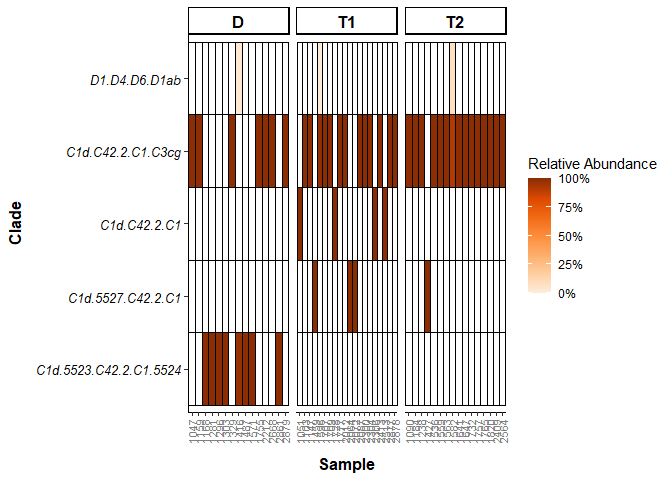

ITS2 community by ploidy
================
EL Strand

## Load libraries

``` r
library(ggplot2)
library(tidyverse)
```

    ## ── Attaching core tidyverse packages ──────────────────────── tidyverse 2.0.0 ──
    ## ✔ dplyr     1.1.4     ✔ readr     2.1.5
    ## ✔ forcats   1.0.0     ✔ stringr   1.5.1
    ## ✔ lubridate 1.9.3     ✔ tibble    3.2.1
    ## ✔ purrr     1.0.2     ✔ tidyr     1.3.1
    ## ── Conflicts ────────────────────────────────────────── tidyverse_conflicts() ──
    ## ✖ dplyr::filter() masks stats::filter()
    ## ✖ dplyr::lag()    masks stats::lag()
    ## ℹ Use the conflicted package (<http://conflicted.r-lib.org/>) to force all conflicts to become errors

``` r
library(naniar) ## replace_with_na_all function
library(ggh4x) ## for facet wrap options
```

    ## 
    ## Attaching package: 'ggh4x'
    ## 
    ## The following object is masked from 'package:ggplot2':
    ## 
    ##     guide_axis_logticks

## Load data

``` r
ploidy <- read.csv("data/metadata/meth_pattern_groups.csv") %>% dplyr::select(-X) %>%
  mutate(Sample.ID = as.character(Sample.ID)) 
head(ploidy)
```

    ##   Sample.ID meth_exp_group
    ## 1      1047              D
    ## 2      1051             T1
    ## 3      1090             T2
    ## 4      1103             T1
    ## 5      1147             T1
    ## 6      1159              D

``` r
its2 <- read.delim2("data/6_HoloInt1_20220706T084046.profiles.absolute.abund_and_meta.txt",
                    sep = "\t", header = T, skip = 6) %>% dplyr::rename(sample_name = X) %>% 
  dplyr::select(-ITS2.type.profile)
its2 <- its2[-c(256:257), ] #removing unnecessary rows
```

## Load meta information

``` r
# read in metadata files 
meta <- read.csv("data/metadata/ITS2/Sample_variables.csv") %>% dplyr::rename(sample_name = sample)

# changing metadata to be correct time point 
meta$Timepoint[which(meta$Plug_ID == "2153")] <- "4"

# flip sample 192 and 193 b/c of lab mix-up
meta$sample_name[which(meta$Plug_ID == "1755")] <- "HP193"
meta$sample_name[which(meta$Plug_ID == "1246")] <- "HP192"

meta <- meta %>% dplyr::select(sample_name, Sample.ID=Plug_ID)
```

## Making relative abundance dataframe

``` r
otu <- its2 %>% left_join(., meta, by = "sample_name") %>% 
  dplyr::select(-sample_name) %>%  
  
  ## only those samples and ITS2 types in molecular dataset P.acuta
  filter(Sample.ID %in% ploidy$Sample.ID) %>%
   column_to_rownames(var = "Sample.ID") %>%
  mutate(across(everything(), as.numeric)) %>%
  select(where(~ sum(., na.rm = TRUE) != 0)) 

# Step 1: Calculate row totals
row_totals <- rowSums(otu)

# Step 2: Divide each cell by its row total
otu_normalized <- otu / row_totals

otu_normalized <- otu_normalized %>% rownames_to_column(var = "Sample.ID") %>%
  left_join(., ploidy, by = "Sample.ID") %>%
  gather(key=Clade, value=relabund, 2:6)
```

## Plotting

``` r
 otu_normalized %>% replace_with_na_all(condition = ~.x == 0.000000000) %>%
  ggplot(., aes(x = Sample.ID, y = Clade)) + 
  geom_tile(aes(fill = relabund), color = "black") +
  scale_fill_distiller(palette = "Oranges", na.value = "white", 
                       direction=100, labels = scales::label_percent(scale=100),
                       limits = c(min(otu_normalized$relabund), max(otu_normalized$relabund))) + 
  facet_grid(~meth_exp_group, scales = "free") +
  labs(x="Sample", fill="Relative Abundance", y="Clade") +
  theme_classic() +
  theme(axis.text.x = element_text(angle = 90, vjust=0.5, hjust=0.5, size=8, color='grey50'),
        axis.text.y = element_text(colour = 'black', size = 10, face = 'italic'),
        
    axis.title.y = element_text(margin = margin(t = 0, r = 10, b = 0, l = 0), size=12, face="bold"),
    axis.title.x = element_text(margin = margin(t = 10, r = 0, b = 0, l = 0), size=12, face="bold"),
    
    ## facet wrap labels
    strip.text.x = element_text(color = "black", face = "bold", size = 12),
    strip.text.y = element_text(color = "black", face = "bold", size = 12, angle=0),
    strip.background.y = element_blank() 
  )
```

<!-- -->

``` r
ggsave("data/figures/Supplemental Figure 5 ITS2.png", width=10, height=4)
```
