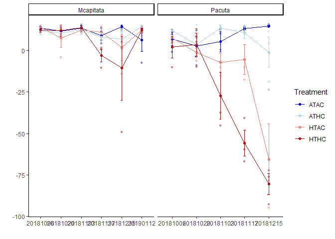
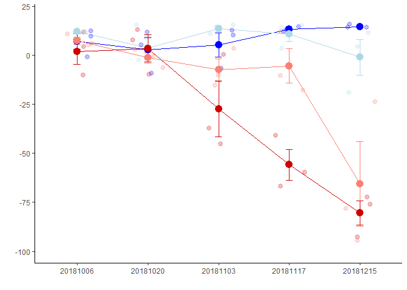

Color Score
================
Author: Emma Strand; <emma.strand@gmgi.org>

## Load libraries

``` r
library(plyr)
library(dplyr)
```

    ## 
    ## Attaching package: 'dplyr'

    ## The following objects are masked from 'package:plyr':
    ## 
    ##     arrange, count, desc, failwith, id, mutate, rename, summarise,
    ##     summarize

    ## The following objects are masked from 'package:stats':
    ## 
    ##     filter, lag

    ## The following objects are masked from 'package:base':
    ## 
    ##     intersect, setdiff, setequal, union

``` r
library(tidyverse)
```

    ## ── Attaching core tidyverse packages ──────────────────────── tidyverse 2.0.0 ──
    ## ✔ forcats   1.0.0     ✔ readr     2.1.5
    ## ✔ ggplot2   3.5.1     ✔ stringr   1.5.1
    ## ✔ lubridate 1.9.3     ✔ tibble    3.2.1
    ## ✔ purrr     1.0.2     ✔ tidyr     1.3.1

    ## ── Conflicts ────────────────────────────────────────── tidyverse_conflicts() ──
    ## ✖ dplyr::arrange()   masks plyr::arrange()
    ## ✖ purrr::compact()   masks plyr::compact()
    ## ✖ dplyr::count()     masks plyr::count()
    ## ✖ dplyr::desc()      masks plyr::desc()
    ## ✖ dplyr::failwith()  masks plyr::failwith()
    ## ✖ dplyr::filter()    masks stats::filter()
    ## ✖ dplyr::id()        masks plyr::id()
    ## ✖ dplyr::lag()       masks stats::lag()
    ## ✖ dplyr::mutate()    masks plyr::mutate()
    ## ✖ dplyr::rename()    masks plyr::rename()
    ## ✖ dplyr::summarise() masks plyr::summarise()
    ## ✖ dplyr::summarize() masks plyr::summarize()
    ## ℹ Use the conflicted package (<http://conflicted.r-lib.org/>) to force all conflicts to become errors

``` r
library(ggplot2)
library(Rmisc)
```

    ## Loading required package: lattice

## Read in datafiles

``` r
raw <- read.csv("data/Molecular_fragments_color.csv", colClasses=c("Plug_ID"="character", 
                                                                               "Timepoint"="character",
                                                                               "Sample_Date"="character",
                                                                               "PhotoDate"="character")) %>%
  dplyr::rename(Date = Sample_Date) %>%
  filter(!is.na(ColorScore))

range(raw$ColorScore)
```

    ## [1] -94.71211  15.69366

``` r
stats <- summarySE(raw, measurevar = c("ColorScore"), groupvars = c("Species", "Date", "Treatment"))
```

## Plot

``` r
raw %>%
  ggplot(., aes(x=Date, y=ColorScore, color=Treatment)) +
  geom_point(alpha=0.4, size=1) +
  theme_classic() + xlab("") + ylab("") +
  scale_color_manual(values = c("blue", "lightblue", "salmon", "red3")) +
  geom_point(data = stats, aes(x=Date, y=ColorScore), size=1.5) +
  geom_errorbar(data = stats, aes(ymin=ColorScore-se, ymax=ColorScore+se), size=0.3, width=.1) +
  geom_line(data=stats, aes(group = Treatment), size=0.3) +
  facet_grid(~Species, scales = "free")
```

    ## Warning: Using `size` aesthetic for lines was deprecated in ggplot2 3.4.0.
    ## ℹ Please use `linewidth` instead.
    ## This warning is displayed once every 8 hours.
    ## Call `lifecycle::last_lifecycle_warnings()` to see where this warning was
    ## generated.

<!-- -->

``` r
pacuta_raw <- raw %>% subset(Species == "Pacuta")
pacuta_stats <- stats %>% subset(Species == "Pacuta")

pacuta_raw %>%
  ggplot(., aes(x=Date, y=ColorScore, color=Treatment)) +
  theme_classic() + xlab("") + ylab("") +
  theme(legend.position="none") +
  ylim(-100,20) +
  scale_color_manual(values = c("blue", "lightblue", "salmon", "red3")) +
  geom_errorbar(data = pacuta_stats, aes(ymin=ColorScore-se, ymax=ColorScore+se), size=0.5, width=.1) +
  geom_line(data=pacuta_stats, aes(group = Treatment), size=0.5) +
  geom_jitter(alpha=0.25, size=2.5, width = 0.22) + 
  geom_point(data = pacuta_stats, aes(x=Date, y=ColorScore), size=4) 
```

<!-- -->

``` r
ggsave(file="data/figures/Figure 1 Color_Pacuta.png", width = 7, height = 5, units = c("in")) 
```

## Ploidy

``` r
# ## pca_data_all info from DMG-Pacuta
# ploidy_meta <- pca_data_all %>% dplyr::select(Sample.ID, meth_exp_group) %>% 
#   distinct() %>% dplyr::rename(Plug_ID = Sample.ID)
#   
# pacuta_raw %>% 
#   left_join(., ploidy_meta, by=c("Plug_ID")) %>%
#     filter(!meth_exp_group == "ungroup") %>%
#   ggplot(., aes(x=Date, y=ColorScore, color=Treatment)) +
#   theme_classic() + xlab("") + ylab("") +
#   scale_shape_manual(values = c(1,2,17)) +
#   theme(legend.position="none") +
#   ylim(-100,20) +
#   scale_color_manual(values = c("blue", "lightblue", "salmon", "red3")) +
#   geom_errorbar(data = pacuta_stats, aes(ymin=ColorScore-se, ymax=ColorScore+se), size=0.5, width=.1) +
#   geom_line(data=pacuta_stats, aes(group = Treatment), size=0.5) +
#   geom_jitter(alpha=0.5, size=3, width = 0.22, aes(shape=meth_exp_group)) + 
#   geom_point(data = pacuta_stats, aes(x=Date, y=ColorScore), size=2)
# 
# pacuta_raw %>%
#   left_join(., ploidy_meta, by=c("Plug_ID")) %>%
#   filter(!meth_exp_group == "ungroup") %>%
#   ggplot(., aes(x=meth_exp_group, y=ColorScore, color=meth_exp_group, shape=meth_exp_group)) +
#   geom_boxplot() + 
#   geom_jitter(alpha=0.7, size=4, width = 0.15) + theme_classic() + 
#   scale_shape_manual(values=c(1, 2, 17)) +
#   scale_colour_manual(values = c("skyblue3", "olivedrab4", "darkgreen")) 
# 
# stats2 <- pacuta_raw %>% 
#   left_join(., ploidy_meta, by=c("Plug_ID")) %>%
#     filter(!meth_exp_group == "ungroup")
# 
# summary(aov(ColorScore ~ meth_exp_group, data=stats2))
# 
# pacuta_raw$Color.Transformed <- pacuta_raw$ColorScore+100
# range(pacuta_raw$Color.Transformed)
# hist(pacuta_raw$Color.Transformed)
# 
# pacuta_raw2 <- pacuta_raw %>%
#   mutate(Temperature = 
#            case_when(
#              Treatment == "ATAC" ~ "Ambient",
#              Treatment == "ATHC" ~ "Ambient",
#              Treatment == "HTAC" ~ "High",
#              Treatment == "HTHC" ~ "High"
#            )) %>%
#   mutate(CO2 = 
#            case_when(
#              Treatment == "ATAC" ~ "Ambient",
#              Treatment == "ATHC" ~ "High",
#              Treatment == "HTAC" ~ "Ambient",
#              Treatment == "HTHC" ~ "High"
#            ))
# 
# stats3 <- lm(log10(Color.Transformed) ~ Timepoint*Temperature*CO2, 
#                na.action=na.omit, data=pacuta_raw2)
# 
# qqPlot(residuals(stats3)) 
# hist(residuals(stats3))
# 
# stats3.anova <- Anova(stats3, ddf="lme4", type='III')
```
