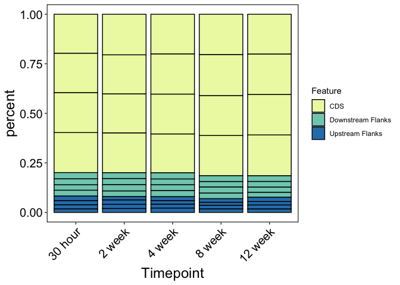

Genomic Feature
================
Author: Emma Strand; <emma_strand@uri.edu>

# Genomic Feature Analysis

## Install Packages

``` r
library(plyr)
require(RColorBrewer)
```

    ## Loading required package: RColorBrewer

``` r
require(dichromat)
```

    ## Loading required package: dichromat

``` r
require(compositions)
```

    ## Loading required package: compositions

    ## Welcome to compositions, a package for compositional data analysis.
    ## Find an intro with "? compositions"

    ## 
    ## Attaching package: 'compositions'

    ## The following objects are masked from 'package:stats':
    ## 
    ##     anova, cor, cov, dist, var

    ## The following objects are masked from 'package:base':
    ## 
    ##     %*%, norm, scale, scale.default

``` r
require(vegan)
```

    ## Loading required package: vegan

    ## Loading required package: permute

    ## Loading required package: lattice

    ## This is vegan 2.6-2

``` r
require(cluster)
```

    ## Loading required package: cluster

``` r
require(dplyr)
```

    ## Loading required package: dplyr

    ## 
    ## Attaching package: 'dplyr'

    ## The following objects are masked from 'package:plyr':
    ## 
    ##     arrange, count, desc, failwith, id, mutate, rename, summarise,
    ##     summarize

    ## The following objects are masked from 'package:stats':
    ## 
    ##     filter, lag

    ## The following objects are masked from 'package:base':
    ## 
    ##     intersect, setdiff, setequal, union

``` r
require(tibble)
```

    ## Loading required package: tibble

``` r
require(tidyr)
```

    ## Loading required package: tidyr

``` r
require(ggplot2)
```

    ## Loading required package: ggplot2

``` r
require(lme4)
```

    ## Loading required package: lme4

    ## Loading required package: Matrix

    ## 
    ## Attaching package: 'Matrix'

    ## The following objects are masked from 'package:tidyr':
    ## 
    ##     expand, pack, unpack

``` r
require(RColorBrewer)
require(Rmisc)
```

    ## Loading required package: Rmisc

## Import metadata

### Filter metadata from larger project

``` r
# meta <- read.csv("data/Master_Fragment.csv", header=TRUE) %>%
#   filter(ANALYSIS == "Molecular" | ANALYSIS == "Physiology/Molecular") %>%
#   write.csv("data/Molecular_metadata.csv")
```

### Read in metadata file

``` r
meta <- read.csv("data/Molecular_metadata.csv", header=TRUE) %>% select(-X)
meta$Plug_ID <- as.character(meta$Plug_ID)
meta$Timepoint <- as.factor(meta$Timepoint)
meta$Timepoint <- factor(meta$Timepoint, levels=c("0 hour","6 hour","12 hour","30 hour",
                                                    "Day 1","1 week","2 week","4 week","6 week",
                                                    "8 week", "12 week", "16 week"))
```

## CpG Methylation Status

### Total

``` r
total_covX5 <- read.table("data/WGBS/genomic_feature/Pacuta-v2-5x-bedgraph-counts.txt", 
                 header = FALSE, col.names = c("totalLines", "filename"))
total_covX5 <- total_covX5[-58,] #Remove last row (total lines for all files)

total_covX10 <- read.table("data/WGBS/genomic_feature/Pacuta-v2-10x-bedgraph-counts.txt", 
                 header = FALSE, col.names = c("totalLines", "filename"))
total_covX10 <- total_covX10[-58,] #Remove last row (total lines for all files)
```

### Methylated

``` r
meth_covX5 <- read.table("data/WGBS/genomic_feature/Pacuta-v2-5x-Meth-counts.txt",
                         header = FALSE, col.names = c("Meth", "filename"))
meth_covX5 <- meth_covX5[-58,] #Remove last row (total lines for all files)

meth_covX10 <- read.table("data/WGBS/genomic_feature/Pacuta-v2-10x-Meth-counts.txt",
                         header = FALSE, col.names = c("Meth", "filename"))
meth_covX10 <- meth_covX10[-58,] #Remove last row (total lines for all files)
```

### Sparsely methylated

``` r
spmeth_covX5 <- read.table("data/WGBS/genomic_feature/Pacuta-v2-5x-sparseMeth-counts.txt",
                         header = FALSE, col.names = c("sparseMeth", "filename"))
spmeth_covX5 <- spmeth_covX5[-58,] #Remove last row (total lines for all files)

spmeth_covX10 <- read.table("data/WGBS/genomic_feature/Pacuta-v2-10x-sparseMeth-counts.txt",
                         header = FALSE, col.names = c("sparseMeth", "filename"))
spmeth_covX10 <- spmeth_covX10[-58,] #Remove last row (total lines for all files)
```

### Unmethylated

``` r
unmeth_covX5 <- read.table("data/WGBS/genomic_feature/Pacuta-v2-5x-unMeth-counts.txt",
                         header = FALSE, col.names = c("unMeth", "filename"))
unmeth_covX5 <- unmeth_covX5[-58,] #Remove last row (total lines for all files)

unmeth_covX10 <- read.table("data/WGBS/genomic_feature/Pacuta-v2-10x-unMeth-counts.txt",
                         header = FALSE, col.names = c("unMeth", "filename"))
unmeth_covX10 <- unmeth_covX10[-58,] #Remove last row (total lines for all files)
```

## Create summary table

``` r
all_5X <- cbind(total_covX5, meth_covX5, spmeth_covX5, unmeth_covX5) 
rownames(all_5X) <- substr(meth_covX5$filename, start = 58, stop = 61)
all_5X <- all_5X[,-c(2,4,6,8)] #Remove filename columns

all_10X <- cbind(total_covX10, meth_covX10, spmeth_covX10, unmeth_covX10) 
rownames(all_10X) <- substr(meth_covX10$filename, start = 58, stop = 61)
all_10X <- all_10X[,-c(2,4,6,8)] #Remove filename columns

head(all_5X)
```

    ##      totalLines   Meth sparseMeth  unMeth
    ## 1047    6865623 196869     273741 6395013
    ## 1051    8069887 213860     334981 7521046
    ## 1059    7444259 194657     252108 6997494
    ## 1090    7980157 196711     325101 7458345
    ## 1103    6832422 173786     272953 6385683
    ## 1147    2852639  59725     152362 2640552

``` r
head(all_10X)
```

    ##      totalLines   Meth sparseMeth  unMeth
    ## 1047    3982376 101484      89982 3790910
    ## 1051    5467738 135771     131726 5200241
    ## 1059    5273220 127601     107382 5038237
    ## 1090    5707710 131345     124921 5451444
    ## 1103    3913593  88841      79343 3745409
    ## 1147     527796   8871      10586  508339

### Calculate percent methylation

``` r
all_5X$percentMeth <- (all_5X$Meth / all_5X$totalLines) * 100 #Calculate percent methylated loci
all_10X$percentMeth <- (all_10X$Meth / all_10X$totalLines) * 100 #Calculate percent methylated loci

all_5X$percentSparseMeth <- (all_5X$sparseMeth / all_5X$totalLines) * 100 #Calculate percent sparsely methylated loci
all_10X$percentSparseMeth <- (all_10X$sparseMeth / all_10X$totalLines) * 100 #Calculate percent sparsely methylated loci

all_5X$percentUnMeth <- (all_5X$unMeth / all_5X$totalLines) * 100 #Calculate percent unmethylated loci
all_10X$percentUnMeth <- (all_10X$unMeth / all_10X$totalLines) * 100 #Calculate percent unmethylated loci

all_5X <- all_5X[,c(1, 2, 5, 3, 6, 4, 7)] #Reorganize columns
all_10X <- all_10X[,c(1, 2, 5, 3, 6, 4, 7)] #Reorganize columns

head(all_5X) #Confirm calculations
```

    ##      totalLines   Meth percentMeth sparseMeth percentSparseMeth  unMeth
    ## 1047    6865623 196869    2.867460     273741          3.987125 6395013
    ## 1051    8069887 213860    2.650099     334981          4.151000 7521046
    ## 1059    7444259 194657    2.614861     252108          3.386610 6997494
    ## 1090    7980157 196711    2.465002     325101          4.073867 7458345
    ## 1103    6832422 173786    2.543549     272953          3.994967 6385683
    ## 1147    2852639  59725    2.093675     152362          5.341089 2640552
    ##      percentUnMeth
    ## 1047      93.14541
    ## 1051      93.19890
    ## 1059      93.99853
    ## 1090      93.46113
    ## 1103      93.46148
    ## 1147      92.56524

``` r
head(all_10X) #Confirm calculations
```

    ##      totalLines   Meth percentMeth sparseMeth percentSparseMeth  unMeth
    ## 1047    3982376 101484    2.548328      89982          2.259505 3790910
    ## 1051    5467738 135771    2.483129     131726          2.409150 5200241
    ## 1059    5273220 127601    2.419793     107382          2.036365 5038237
    ## 1090    5707710 131345    2.301186     124921          2.188636 5451444
    ## 1103    3913593  88841    2.270062      79343          2.027370 3745409
    ## 1147     527796   8871    1.680763      10586          2.005699  508339
    ##      percentUnMeth
    ## 1047      95.19217
    ## 1051      95.10772
    ## 1059      95.54384
    ## 1090      95.51018
    ## 1103      95.70257
    ## 1147      96.31354

### Merge with metadata

``` r
all_5X <- tibble::rownames_to_column(all_5X, "Plug_ID") 

all_5X %>% write.table("data/WGBS/genomic_feature/CpG-percent-5x.txt", 
              sep = "\t", quote = FALSE, row.names = TRUE)

all_10X <- tibble::rownames_to_column(all_10X, "Plug_ID")

all_10X %>% write.table("data/WGBS/genomic_feature/CpG-percent-5x.txt", 
              sep = "\t", quote = FALSE, row.names = TRUE)

all_5X_meta <- merge(all_5X, meta, by = "Plug_ID")
all_10X_meta <- merge(all_10X, meta, by = "Plug_ID")
```

## CpG Genomic location

1.  Downstream flanks
2.  Flanks
3.  Upstream flanks
4.  Gene (Transcript)
5.  Intergenic (Error in previous script don’t have this yet)
6.  Intron (Original gff file has no introns)
7.  CDS

``` r
#Import file with CG motif and feature track overlaps
GenomeFeatures <- read.table("data/WGBS/genomic_feature/Pacuta-v2-CGMotif-Overlaps-counts.txt", 
                                 header = FALSE, col.names = c("counts", "filename")) 

GenomeFeatures <- GenomeFeatures[-6,] #Remove final row

Meth_Status<-rep(c("All_CpGs","Methylated","Sparsely_Methylated","Unmethylated", "not bedgraph"),times=57) # change this value to the rows
```

### Transcript Overlap

#### Import file counts

fixing this in other script.. then edit out the last 3 rows instead of
one

``` r
#Import file with all file-gene overlaps
Transcript5X <- read.table("data/WGBS/genomic_feature/Pacuta-paTranscript5X-counts.txt", 
                               header = FALSE, col.names = c("counts", "filename")) 

Transcript5X <- Transcript5X[-c(286:288),] #Remove final row
tail(Transcript5X) #Confirm import
```

    ##      counts
    ## 280  221239
    ## 281 3374162
    ## 282  166713
    ## 283  141430
    ## 284 3066019
    ## 285  221239
    ##                                                                                                                filename
    ## 280 /data/putnamlab/estrand/HoloInt_WGBS/merged_cov_genomev2/2878_5x_sorted.tab_gene_CpG_5x_enrichment.bed-paTranscript
    ## 281                   /data/putnamlab/estrand/HoloInt_WGBS/merged_cov_genomev2/2879_5x_sorted.bedgraph.bed-paTranscript
    ## 282              /data/putnamlab/estrand/HoloInt_WGBS/merged_cov_genomev2/2879_5x_sorted.bedgraph-Meth.bed-paTranscript
    ## 283        /data/putnamlab/estrand/HoloInt_WGBS/merged_cov_genomev2/2879_5x_sorted.bedgraph-sparseMeth.bed-paTranscript
    ## 284            /data/putnamlab/estrand/HoloInt_WGBS/merged_cov_genomev2/2879_5x_sorted.bedgraph-unMeth.bed-paTranscript
    ## 285 /data/putnamlab/estrand/HoloInt_WGBS/merged_cov_genomev2/2879_5x_sorted.tab_gene_CpG_5x_enrichment.bed-paTranscript

``` r
Transcript10X <- read.table("data/WGBS/genomic_feature/Pacuta-paTranscript10X-counts.txt", 
                               header = FALSE, col.names = c("counts", "filename")) 

Transcript10X <- Transcript10X[-c(286:288),] #Remove final row
tail(Transcript10X) #Confirm import
```

    ##      counts
    ## 280   10152
    ## 281 2439092
    ## 282  102718
    ## 283   66102
    ## 284 2270272
    ## 285   10152
    ##                                                                                                                  filename
    ## 280 /data/putnamlab/estrand/HoloInt_WGBS/merged_cov_genomev2/2878_10x_sorted.tab_gene_CpG_10x_enrichment.bed-paTranscript
    ## 281                    /data/putnamlab/estrand/HoloInt_WGBS/merged_cov_genomev2/2879_10x_sorted.bedgraph.bed-paTranscript
    ## 282               /data/putnamlab/estrand/HoloInt_WGBS/merged_cov_genomev2/2879_10x_sorted.bedgraph-Meth.bed-paTranscript
    ## 283         /data/putnamlab/estrand/HoloInt_WGBS/merged_cov_genomev2/2879_10x_sorted.bedgraph-sparseMeth.bed-paTranscript
    ## 284             /data/putnamlab/estrand/HoloInt_WGBS/merged_cov_genomev2/2879_10x_sorted.bedgraph-unMeth.bed-paTranscript
    ## 285 /data/putnamlab/estrand/HoloInt_WGBS/merged_cov_genomev2/2879_10x_sorted.tab_gene_CpG_10x_enrichment.bed-paTranscript

#### Transform file for methyl status

``` r
Transcript5X$Meth_Status <- Meth_Status
Transcript5X$filename <- gsub("/data/putnamlab/estrand/HoloInt_WGBS/merged_cov_genomev2/","",Transcript5X$filename)
Transcript5X$filename <- gsub("\\_..*","",Transcript5X$filename)
Transcript5X$Feature <- "Transcript"
colnames(Transcript5X)[2] <- "Plug_ID"
Transcript5X <- Transcript5X %>% subset(!Meth_Status == "not bedgraph")

Transcript10X$Meth_Status <- Meth_Status
Transcript10X$filename <- gsub("/data/putnamlab/estrand/HoloInt_WGBS/merged_cov_genomev2/","",Transcript10X$filename)
Transcript10X$filename <- gsub("\\_..*","",Transcript10X$filename)
Transcript10X$Feature <- "Transcript"
colnames(Transcript10X)[2] <- "Plug_ID"
Transcript10X <- Transcript10X %>% subset(!Meth_Status == "not bedgraph")
```

### CDS

#### Import file counts

``` r
#Import file with all file-gene overlaps
CDS5X <- read.table("data/WGBS/genomic_feature/Pacuta-paCDS5X-counts.txt", 
                               header = FALSE, col.names = c("counts", "filename")) 

CDS5X <- CDS5X[-c(286:288),] #Remove final row
tail(CDS5X) #Confirm import
```

    ##      counts
    ## 280  160577
    ## 281 1232504
    ## 282   73601
    ## 283   43687
    ## 284 1115216
    ## 285  160577
    ##                                                                                                         filename
    ## 280 /data/putnamlab/estrand/HoloInt_WGBS/merged_cov_genomev2/2878_5x_sorted.tab_gene_CpG_5x_enrichment.bed-paCDS
    ## 281                   /data/putnamlab/estrand/HoloInt_WGBS/merged_cov_genomev2/2879_5x_sorted.bedgraph.bed-paCDS
    ## 282              /data/putnamlab/estrand/HoloInt_WGBS/merged_cov_genomev2/2879_5x_sorted.bedgraph-Meth.bed-paCDS
    ## 283        /data/putnamlab/estrand/HoloInt_WGBS/merged_cov_genomev2/2879_5x_sorted.bedgraph-sparseMeth.bed-paCDS
    ## 284            /data/putnamlab/estrand/HoloInt_WGBS/merged_cov_genomev2/2879_5x_sorted.bedgraph-unMeth.bed-paCDS
    ## 285 /data/putnamlab/estrand/HoloInt_WGBS/merged_cov_genomev2/2879_5x_sorted.tab_gene_CpG_5x_enrichment.bed-paCDS

``` r
CDS10X <- read.table("data/WGBS/genomic_feature/Pacuta-paCDS10X-counts.txt", 
                               header = FALSE, col.names = c("counts", "filename")) 

CDS10X <- CDS10X[-c(286:288),] #Remove final row
tail(CDS10X) #Confirm import
```

    ##      counts
    ## 280    7606
    ## 281 1029815
    ## 282   53798
    ## 283   27449
    ## 284  948568
    ## 285    7606
    ##                                                                                                           filename
    ## 280 /data/putnamlab/estrand/HoloInt_WGBS/merged_cov_genomev2/2878_10x_sorted.tab_gene_CpG_10x_enrichment.bed-paCDS
    ## 281                    /data/putnamlab/estrand/HoloInt_WGBS/merged_cov_genomev2/2879_10x_sorted.bedgraph.bed-paCDS
    ## 282               /data/putnamlab/estrand/HoloInt_WGBS/merged_cov_genomev2/2879_10x_sorted.bedgraph-Meth.bed-paCDS
    ## 283         /data/putnamlab/estrand/HoloInt_WGBS/merged_cov_genomev2/2879_10x_sorted.bedgraph-sparseMeth.bed-paCDS
    ## 284             /data/putnamlab/estrand/HoloInt_WGBS/merged_cov_genomev2/2879_10x_sorted.bedgraph-unMeth.bed-paCDS
    ## 285 /data/putnamlab/estrand/HoloInt_WGBS/merged_cov_genomev2/2879_10x_sorted.tab_gene_CpG_10x_enrichment.bed-paCDS

#### Transform file for methyl status

``` r
CDS5X$Meth_Status <- Meth_Status
CDS5X$filename <- gsub("/data/putnamlab/estrand/HoloInt_WGBS/merged_cov_genomev2/","",CDS5X$filename)
CDS5X$filename <- gsub("\\_..*","",CDS5X$filename)
CDS5X$Feature <- "CDS"
colnames(CDS5X)[2] <- "Plug_ID"
CDS5X <- CDS5X %>% subset(!Meth_Status == "not bedgraph")

CDS10X$Meth_Status <- Meth_Status
CDS10X$filename <- gsub("/data/putnamlab/estrand/HoloInt_WGBS/merged_cov_genomev2/","",CDS10X$filename)
CDS10X$filename <- gsub("\\_..*","",CDS10X$filename)
CDS10X$Feature <- "CDS"
colnames(CDS10X)[2] <- "Plug_ID"
CDS10X <- CDS10X %>% subset(!Meth_Status == "not bedgraph")
```

### Flanks

#### Import file counts

``` r
#Import file with all file-gene overlaps
Flanks5X <- read.table("data/WGBS/genomic_feature/Pacuta-paFlanks5X-counts.txt", 
                               header = FALSE, col.names = c("counts", "filename")) 

Flanks5X <- Flanks5X[-c(286:288),] #Remove final row
tail(Flanks5X) #Confirm import
```

    ##      counts
    ## 280       0
    ## 281 1065802
    ## 282   19101
    ## 283   41199
    ## 284 1005502
    ## 285       0
    ##                                                                                                            filename
    ## 280 /data/putnamlab/estrand/HoloInt_WGBS/merged_cov_genomev2/2878_5x_sorted.tab_gene_CpG_5x_enrichment.bed-paFlanks
    ## 281                   /data/putnamlab/estrand/HoloInt_WGBS/merged_cov_genomev2/2879_5x_sorted.bedgraph.bed-paFlanks
    ## 282              /data/putnamlab/estrand/HoloInt_WGBS/merged_cov_genomev2/2879_5x_sorted.bedgraph-Meth.bed-paFlanks
    ## 283        /data/putnamlab/estrand/HoloInt_WGBS/merged_cov_genomev2/2879_5x_sorted.bedgraph-sparseMeth.bed-paFlanks
    ## 284            /data/putnamlab/estrand/HoloInt_WGBS/merged_cov_genomev2/2879_5x_sorted.bedgraph-unMeth.bed-paFlanks
    ## 285 /data/putnamlab/estrand/HoloInt_WGBS/merged_cov_genomev2/2879_5x_sorted.tab_gene_CpG_5x_enrichment.bed-paFlanks

``` r
Flanks10X <- read.table("data/WGBS/genomic_feature/Pacuta-paFlanks10X-counts.txt", 
                               header = FALSE, col.names = c("counts", "filename")) 

Flanks10X <- Flanks10X[-c(286:288),] #Remove final row
tail(Flanks10X) #Confirm import
```

    ##     counts
    ## 280      0
    ## 281 698081
    ## 282  10516
    ## 283  15861
    ## 284 671704
    ## 285      0
    ##                                                                                                              filename
    ## 280 /data/putnamlab/estrand/HoloInt_WGBS/merged_cov_genomev2/2878_10x_sorted.tab_gene_CpG_10x_enrichment.bed-paFlanks
    ## 281                    /data/putnamlab/estrand/HoloInt_WGBS/merged_cov_genomev2/2879_10x_sorted.bedgraph.bed-paFlanks
    ## 282               /data/putnamlab/estrand/HoloInt_WGBS/merged_cov_genomev2/2879_10x_sorted.bedgraph-Meth.bed-paFlanks
    ## 283         /data/putnamlab/estrand/HoloInt_WGBS/merged_cov_genomev2/2879_10x_sorted.bedgraph-sparseMeth.bed-paFlanks
    ## 284             /data/putnamlab/estrand/HoloInt_WGBS/merged_cov_genomev2/2879_10x_sorted.bedgraph-unMeth.bed-paFlanks
    ## 285 /data/putnamlab/estrand/HoloInt_WGBS/merged_cov_genomev2/2879_10x_sorted.tab_gene_CpG_10x_enrichment.bed-paFlanks

#### Transform file for methyl status

``` r
Flanks5X$Meth_Status <- Meth_Status
Flanks5X$filename <- gsub("/data/putnamlab/estrand/HoloInt_WGBS/merged_cov_genomev2/","",Flanks5X$filename)
Flanks5X$filename <- gsub("\\_..*","",Flanks5X$filename)
Flanks5X$Feature <- "Flanks"
colnames(Flanks5X)[2] <- "Plug_ID"
Flanks5X <- Flanks5X %>% subset(!Meth_Status == "not bedgraph")

Flanks10X$Meth_Status <- Meth_Status
Flanks10X$filename <- gsub("/data/putnamlab/estrand/HoloInt_WGBS/merged_cov_genomev2/","",Flanks10X$filename)
Flanks10X$filename <- gsub("\\_..*","",Flanks10X$filename)
Flanks10X$Feature <- "Flanks"
colnames(Flanks10X)[2] <- "Plug_ID"
Flanks10X <- Flanks10X %>% subset(!Meth_Status == "not bedgraph")
```

### Upstream Flanks

#### Import file counts

``` r
UpstreamFlanks5X <- read.table("data/WGBS/genomic_feature/Pacuta-paFlanksUpstream5X-counts.txt", 
                               header = FALSE, col.names = c("counts", "filename")) 

UpstreamFlanks5X <- UpstreamFlanks5X[-c(286:288),] #Remove final row
tail(UpstreamFlanks5X) #Confirm import
```

    ##     counts
    ## 280      0
    ## 281 616487
    ## 282   7889
    ## 283  21571
    ## 284 587027
    ## 285      0
    ##                                                                                                                    filename
    ## 280 /data/putnamlab/estrand/HoloInt_WGBS/merged_cov_genomev2/2878_5x_sorted.tab_gene_CpG_5x_enrichment.bed-paFlanksUpstream
    ## 281                   /data/putnamlab/estrand/HoloInt_WGBS/merged_cov_genomev2/2879_5x_sorted.bedgraph.bed-paFlanksUpstream
    ## 282              /data/putnamlab/estrand/HoloInt_WGBS/merged_cov_genomev2/2879_5x_sorted.bedgraph-Meth.bed-paFlanksUpstream
    ## 283        /data/putnamlab/estrand/HoloInt_WGBS/merged_cov_genomev2/2879_5x_sorted.bedgraph-sparseMeth.bed-paFlanksUpstream
    ## 284            /data/putnamlab/estrand/HoloInt_WGBS/merged_cov_genomev2/2879_5x_sorted.bedgraph-unMeth.bed-paFlanksUpstream
    ## 285 /data/putnamlab/estrand/HoloInt_WGBS/merged_cov_genomev2/2879_5x_sorted.tab_gene_CpG_5x_enrichment.bed-paFlanksUpstream

``` r
UpstreamFlanks10X <- read.table("data/WGBS/genomic_feature/Pacuta-paFlanksUpstream10X-counts.txt", 
                               header = FALSE, col.names = c("counts", "filename")) 

UpstreamFlanks10X <- UpstreamFlanks10X[-c(286:288),] #Remove final row
tail(UpstreamFlanks10X) #Confirm import
```

    ##     counts
    ## 280      0
    ## 281 416106
    ## 282   4625
    ## 283   8357
    ## 284 403124
    ## 285      0
    ##                                                                                                                      filename
    ## 280 /data/putnamlab/estrand/HoloInt_WGBS/merged_cov_genomev2/2878_10x_sorted.tab_gene_CpG_10x_enrichment.bed-paFlanksUpstream
    ## 281                    /data/putnamlab/estrand/HoloInt_WGBS/merged_cov_genomev2/2879_10x_sorted.bedgraph.bed-paFlanksUpstream
    ## 282               /data/putnamlab/estrand/HoloInt_WGBS/merged_cov_genomev2/2879_10x_sorted.bedgraph-Meth.bed-paFlanksUpstream
    ## 283         /data/putnamlab/estrand/HoloInt_WGBS/merged_cov_genomev2/2879_10x_sorted.bedgraph-sparseMeth.bed-paFlanksUpstream
    ## 284             /data/putnamlab/estrand/HoloInt_WGBS/merged_cov_genomev2/2879_10x_sorted.bedgraph-unMeth.bed-paFlanksUpstream
    ## 285 /data/putnamlab/estrand/HoloInt_WGBS/merged_cov_genomev2/2879_10x_sorted.tab_gene_CpG_10x_enrichment.bed-paFlanksUpstream

#### Transform file for methyl status

``` r
UpstreamFlanks5X$Meth_Status <- Meth_Status
UpstreamFlanks5X$filename <- gsub("/data/putnamlab/estrand/HoloInt_WGBS/merged_cov_genomev2/","",UpstreamFlanks5X$filename)
UpstreamFlanks5X$filename <- gsub("\\_..*","",UpstreamFlanks5X$filename)
UpstreamFlanks5X$Feature <- "Upstream Flanks"
colnames(UpstreamFlanks5X)[2] <- "Plug_ID"
UpstreamFlanks5X <- UpstreamFlanks5X %>% subset(!Meth_Status == "not bedgraph")

UpstreamFlanks10X$Meth_Status <- Meth_Status
UpstreamFlanks10X$filename <- gsub("/data/putnamlab/estrand/HoloInt_WGBS/merged_cov_genomev2/","",UpstreamFlanks10X$filename)
UpstreamFlanks10X$filename <- gsub("\\_..*","",UpstreamFlanks10X$filename)
UpstreamFlanks10X$Feature <- "Upstream Flanks"
colnames(UpstreamFlanks10X)[2] <- "Plug_ID"
UpstreamFlanks10X <- UpstreamFlanks10X %>% subset(!Meth_Status == "not bedgraph")
```

## Gather above data

### Bind datasets together

``` r
cpg_gf_meth5X <- rbind(Transcript5X, CDS5X, Flanks5X, UpstreamFlanks5X)
cpg_gf_meth10X <- rbind(Transcript10X, CDS10X, Flanks10X, UpstreamFlanks10X)
```

### Calculate downstream flanks (All flanks - upstream)

``` r
### 5X
cpg_gf_meth5X_2 <- cpg_gf_meth5X %>% 
  pivot_wider(names_from = Feature, values_from = counts)

cpg_gf_meth5X_2$`Downstream Flanks` <- cpg_gf_meth5X_2$Flanks - cpg_gf_meth5X_2$`Upstream Flanks`

# convert back to long format 
cpg_gf_meth5X_3 <- cpg_gf_meth5X_2 %>% 
  pivot_longer(!(c(Plug_ID, Meth_Status)), names_to = "Feature", values_to = "counts")

### 10X
cpg_gf_meth10X_2 <- cpg_gf_meth10X %>% 
  pivot_wider(names_from = Feature, values_from = counts)

cpg_gf_meth10X_2$`Downstream Flanks` <- cpg_gf_meth10X_2$Flanks - cpg_gf_meth10X_2$`Upstream Flanks`

# convert back to long format 
cpg_gf_meth10X_3 <- cpg_gf_meth10X_2 %>% 
  pivot_longer(!(c(Plug_ID, Meth_Status)), names_to = "Feature", values_to = "counts")
```

### Calculate percentages

``` r
#Calculate percentages 
### 5X
cpg_gf_meth5X_4 <- cpg_gf_meth5X_2 %>% 
  select(-Transcript, -Flanks) #remove gene and total flank rows

cpg_gf_meth5X_4[,c(3:5)] <- round((cpg_gf_meth5X_4[,c(3:5)]/rowSums(cpg_gf_meth5X_4[,c(3:5)]))*100,2) # calculating percentages 

#Convert back to long format, this is just percents
cpg_gf_meth5X_5 <- cpg_gf_meth5X_4 %>% pivot_longer(!(c(Plug_ID, Meth_Status)), names_to = "Feature", values_to = "percent")


### 10X
cpg_gf_meth10X_4 <- cpg_gf_meth10X_2 %>% 
  select(-Transcript, -Flanks) #remove gene and total flank rows

cpg_gf_meth10X_4[,c(3:5)] <- round((cpg_gf_meth10X_4[,c(3:5)]/rowSums(cpg_gf_meth10X_4[,c(3:5)]))*100,2) # calculating percentages 

#Convert back to long format, this is just percents
cpg_gf_meth10X_5 <- cpg_gf_meth10X_4 %>% pivot_longer(!(c(Plug_ID, Meth_Status)), names_to = "Feature", values_to = "percent")
```

### Adding metadata

``` r
cpg_gf_meth_5X_counts <- merge(cpg_gf_meth5X_3, meta, by = "Plug_ID")
cpg_gf_meth_10X_counts <- merge(cpg_gf_meth10X_3, meta, by = "Plug_ID")

nrow(cpg_gf_meth_5X_counts) #1140 
```

    ## [1] 1140

``` r
nrow(cpg_gf_meth_10X_counts) #1140
```

    ## [1] 1140

``` r
cpg_gf_meth_5X_percent <- merge(cpg_gf_meth5X_5, meta, by = "Plug_ID")
cpg_gf_meth_10X_percent <- merge(cpg_gf_meth10X_5, meta, by = "Plug_ID")

nrow(cpg_gf_meth_5X_percent) #684 
```

    ## [1] 684

``` r
nrow(cpg_gf_meth_10X_percent) #684
```

    ## [1] 684

Double checking the correct number of rows:

counts: 57 samples x 4 meth statuses x 5 genomic features = 1140

percent: 57 samples x 4 meth statuses x 3 genomic features = 684

## Plotting with Barcharts and Statistics

### Methylated

``` r
cpg_gf_meth_5X_percent %>% 
  filter(Meth_Status == "Methylated") %>%
  ggplot(., aes(x=Timepoint, y=percent, color = Treatment, fill = Treatment)) +
  geom_boxplot(width=.5, outlier.shape= NA, position = position_dodge(width = 0.5), alpha = 0.7) +
 # stat_summary(fun=mean, geom="line", aes(group=Treatment, color = Treatment), position = position_dodge(width = 0.5))  + 
 # geom_point(pch = 21, position=position_jitterdodge(), outlier.shape= NA) +
  scale_colour_manual(values=c("blue", "lightblue", "salmon", "red3")) +
  scale_fill_manual(values=c("blue", "lightblue", "salmon", "red3")) +
  theme_classic() + ggtitle("5X Methylated") +
  theme(panel.border = element_rect(color="black", fill=NA, size=0.75), 
        panel.grid.major = element_blank(),
        panel.grid.minor = element_blank(), axis.line = element_blank()) +
  theme(axis.text = element_text(size = 10, color = "black"),
        axis.title = element_text(size = 12, color = "black")) +
  theme(axis.text.x = element_text(angle = 60, vjust = 1.2, hjust = 1.3)) + #Set the text angle
  facet_wrap(~ Feature, scales = "free")
```

<!-- -->

``` r
cpg_gf_meth_10X_percent %>% 
  filter(Meth_Status == "Methylated") %>%
  ggplot(., aes(x=Timepoint, y=percent, color = Treatment, fill = Treatment)) +
  geom_boxplot(width=.5, outlier.shape= NA, position = position_dodge(width = 0.5), alpha = 0.7) +
 # stat_summary(fun=mean, geom="line", aes(group=Treatment, color = Treatment), position = position_dodge(width = 0.5))  + 
 # geom_point(pch = 21, position=position_jitterdodge(), outlier.shape= NA) +
  scale_colour_manual(values=c("blue", "lightblue", "salmon", "red3")) +
  scale_fill_manual(values=c("blue", "lightblue", "salmon", "red3")) +
  theme_classic() + ggtitle("10X Methylated") +
  theme(panel.border = element_rect(color="black", fill=NA, size=0.75), 
        panel.grid.major = element_blank(),
        panel.grid.minor = element_blank(), axis.line = element_blank()) +
  theme(axis.text = element_text(size = 10, color = "black"),
        axis.title = element_text(size = 12, color = "black")) +
  theme(axis.text.x = element_text(angle = 60, vjust = 1.2, hjust = 1.3)) + #Set the text angle
  facet_wrap(~ Feature, scales = "free")
```

<!-- -->

### All CpGs

``` r
cpg_gf_meth_5X_percent %>% 
  filter(Meth_Status == "All_CpGs") %>%
  ggplot(., aes(x=Timepoint, y=percent, color = Treatment, fill = Treatment)) +
  geom_boxplot(width=.5, outlier.shape= NA, position = position_dodge(width = 0.5), alpha = 0.7) +
 # stat_summary(fun=mean, geom="line", aes(group=Treatment, color = Treatment), position = position_dodge(width = 0.5))  + 
 # geom_point(pch = 21, position=position_jitterdodge(), outlier.shape= NA) +
  scale_colour_manual(values=c("blue", "lightblue", "salmon", "red3")) +
  scale_fill_manual(values=c("blue", "lightblue", "salmon", "red3")) +
  theme_classic() + ggtitle("5X All_CpGs") +
  theme(panel.border = element_rect(color="black", fill=NA, size=0.75), 
        panel.grid.major = element_blank(),
        panel.grid.minor = element_blank(), axis.line = element_blank()) +
  theme(axis.text = element_text(size = 10, color = "black"),
        axis.title = element_text(size = 12, color = "black")) +
  theme(axis.text.x = element_text(angle = 60, vjust = 1.2, hjust = 1.3)) + #Set the text angle
  facet_wrap(~ Feature, scales = "free")
```

<!-- -->

``` r
cpg_gf_meth_10X_percent %>% 
  filter(Meth_Status == "All_CpGs") %>%
  ggplot(., aes(x=Timepoint, y=percent, color = Treatment, fill = Treatment)) +
  geom_boxplot(width=.5, outlier.shape= NA, position = position_dodge(width = 0.5), alpha = 0.7) +
 # stat_summary(fun=mean, geom="line", aes(group=Treatment, color = Treatment), position = position_dodge(width = 0.5))  + 
 # geom_point(pch = 21, position=position_jitterdodge(), outlier.shape= NA) +
  scale_colour_manual(values=c("blue", "lightblue", "salmon", "red3")) +
  scale_fill_manual(values=c("blue", "lightblue", "salmon", "red3")) +
  theme_classic() + ggtitle("10X All_CpGs") +
  theme(panel.border = element_rect(color="black", fill=NA, size=0.75), 
        panel.grid.major = element_blank(),
        panel.grid.minor = element_blank(), axis.line = element_blank()) +
  theme(axis.text = element_text(size = 10, color = "black"),
        axis.title = element_text(size = 12, color = "black")) +
  theme(axis.text.x = element_text(angle = 60, vjust = 1.2, hjust = 1.3)) + #Set the text angle
  facet_wrap(~ Feature, scales = "free")
```

<!-- -->

### Barchart All CpGs

``` r
cpg_gf_meth_5X_percent_all <- cpg_gf_meth_5X_percent %>%  filter(Meth_Status == "All_CpGs")
cpg_gf_meth_5X_percent_all_mean <- summarySE(cpg_gf_meth_5X_percent_all, 
                                           measurevar="percent", groupvars=c("Treatment", "Timepoint", "Feature"))

cpg_gf_meth_5X_percent_all_mean %>%
  ggplot(., aes(fill=Feature, y=percent, x=Timepoint)) + 
  geom_bar(position="fill", stat="identity", color = "black") +
  scale_fill_brewer(palette = "YlGnBu") +
  theme_bw() + 
  theme(panel.border = element_rect(color="black", fill=NA, size=0.75), 
        panel.grid.major = element_blank(),
        panel.grid.minor = element_blank(), axis.line = element_blank()) +
  theme(axis.text = element_text(size = 15, color = "black"),
        axis.title = element_text(size = 18, color = "black"), 
        axis.text.x = element_text(angle = 45, hjust=1))
```

<!-- -->

``` r
cpg_gf_meth_10X_percent_all <- cpg_gf_meth_10X_percent %>%  filter(Meth_Status == "All_CpGs")
cpg_gf_meth_10X_percent_all_mean <- summarySE(cpg_gf_meth_10X_percent_all, 
                                           measurevar="percent", groupvars=c("Treatment", "Timepoint", "Feature"))

cpg_gf_meth_10X_percent_all_mean %>%
  ggplot(., aes(fill=Feature, y=percent, x=Timepoint)) + 
  geom_bar(position="fill", stat="identity", color = "black") +
  scale_fill_brewer(palette = "YlGnBu") +
  theme_bw() + 
  theme(panel.border = element_rect(color="black", fill=NA, size=0.75), 
        panel.grid.major = element_blank(),
        panel.grid.minor = element_blank(), axis.line = element_blank()) +
  theme(axis.text = element_text(size = 15, color = "black"),
        axis.title = element_text(size = 18, color = "black"), 
        axis.text.x = element_text(angle = 45, hjust=1))
```

<!-- -->

``` r
cpg_gf_meth_5X_percent_meth <- cpg_gf_meth_5X_percent %>%  filter(Meth_Status == "Methylated")
cpg_gf_meth_5X_percent_meth_mean <- summarySE(cpg_gf_meth_5X_percent_meth, 
                                           measurevar="percent", groupvars=c("Treatment", "Timepoint", "Feature"))

cpg_gf_meth_5X_percent_meth_mean %>%
    ggplot(., aes(fill=Feature, y=percent, x=Timepoint)) + 
  geom_bar(position="fill", stat="identity", color = "black") +
  scale_fill_brewer(palette = "YlGnBu") +
  theme_bw() + 
  theme(panel.border = element_rect(color="black", fill=NA, size=0.75), 
        panel.grid.major = element_blank(),
        panel.grid.minor = element_blank(), axis.line = element_blank()) +
  theme(axis.text = element_text(size = 15, color = "black"),
        axis.title = element_text(size = 18, color = "black"), 
        axis.text.x = element_text(angle = 45, hjust=1))
```

<!-- -->

``` r
cpg_gf_meth_10X_percent_meth <- cpg_gf_meth_10X_percent %>%  filter(Meth_Status == "Methylated")
cpg_gf_meth_10X_percent_meth_mean <- summarySE(cpg_gf_meth_10X_percent_meth, 
                                           measurevar="percent", groupvars=c("Treatment", "Timepoint", "Feature"))

cpg_gf_meth_10X_percent_meth_mean %>%
    ggplot(., aes(fill=Feature, y=percent, x=Timepoint)) + 
  geom_bar(position="fill", stat="identity", color = "black") +
  scale_fill_brewer(palette = "YlGnBu") +
  theme_bw() + 
  theme(panel.border = element_rect(color="black", fill=NA, size=0.75), 
        panel.grid.major = element_blank(),
        panel.grid.minor = element_blank(), axis.line = element_blank()) +
  theme(axis.text = element_text(size = 15, color = "black"),
        axis.title = element_text(size = 18, color = "black"), 
        axis.text.x = element_text(angle = 45, hjust=1))
```

<!-- -->
